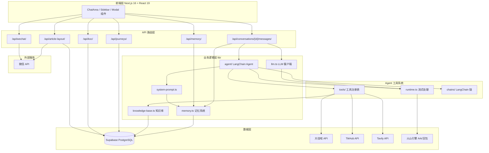
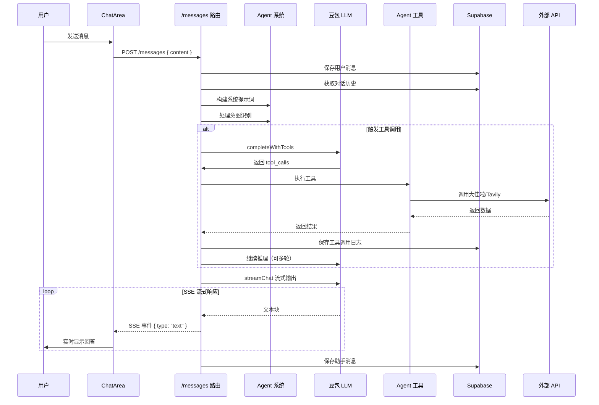
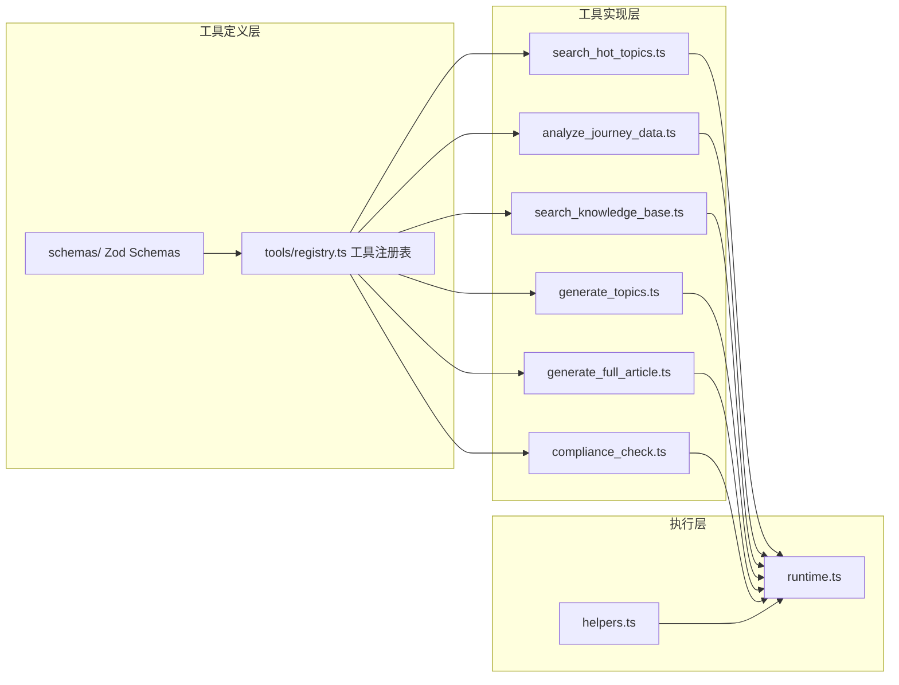
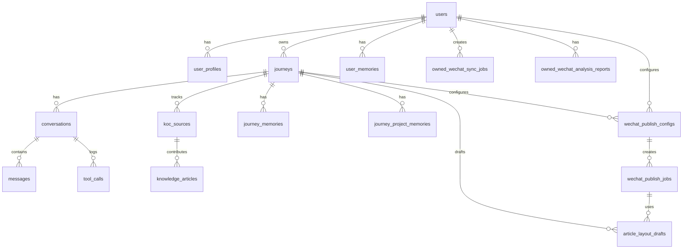

# Niche 项目技术架构图

## 一、整体架构（Mermaid）



## 二、数据流向图

### 用户消息处理流程



## 三、Agent 工具系统架构



## 四、数据库 Schema 关系



## 五、关键模块详细关系

### LLM 调用链路

```
用户消息
    │
    ▼
┌───────────────────────────────────────┐
│  app/api/conversations/[id]/messages/ │
│  - 意图识别 (resolveUserIntentChain)   │
│  - 焦点解析 (resolveSearchFocusChain)  │
│  - 自然语言跟进处理                     │
│  - 工具执行循环                         │
└───────────────────────────────────────┘
    │
    ├──────────────────────────────────┐
    │                                  │
    ▼                                  ▼
┌───────────────┐            ┌─────────────────┐
│ lib/llm.ts    │            │ lib/agent/      │
│ (统一接口)    │            │                 │
│               │            │                 │
│ - streamChat  │◄───────────┤ models.ts       │
│ - chat        │            │ - 模型工厂      │
│ - complete    │            │ - ChatOpenAI    │
└───────────────┘            └─────────────────┘
                                      │
                                      ▼
                            ┌─────────────────┐
                            │ runtime.ts      │
                            │                 │
                            │ - streamText    │
                            │ - invokeText    │
                            │ - invokeTools   │
                            └─────────────────┘
                                      │
                                      ▼
                            ┌─────────────────┐
                            │ 火山引擎 Ark    │
                            │ Chat API        │
                            │                 │
                            │ 深度思考 (可选) │
                            └─────────────────┘
```

### 知识库架构

```
┌─────────────────────────────────────────────────────┐
│                  知识库系统                          │
├─────────────────────────────────────────────────────┤
│                                                     │
│  ┌──────────────┐      ┌────────────────────┐     │
│  │ koc_sources  │      │ knowledge_articles │     │
│  │              │      │                    │     │
│  │ - 账号名     │◄────►│ - 标题             │     │
│  │ - ghid       │      │ - 内容             │     │
│  │ - 粉丝数     │      │ - 阅读数           │     │
│  │ - 头像       │      │ - HTML             │     │
│  └──────────────┘      │ - 全文搜索向量     │     │
│                        │                    │     │
│                        └────────────────────┘     │
│                                   │                │
│                                   ▼                │
│                        ┌────────────────────┐     │
│                        │ knowledge-base.ts  │     │
│                        │                    │     │
│                        │ - pgvector 搜索    │     │
│                        │ - 全文搜索         │     │
│                        │ - 账号过滤         │     │
│                        └────────────────────┘     │
│                                                     │
│  数据源：                                          │
│  • 大佳啦 API → 知识库同步                         │
│  • TikHub API → 补充数据                           │
│                                                     │
└─────────────────────────────────────────────────────┘
```

## 六、技术栈清单

### 前端
| 技术 | 版本 | 用途 |
|------|------|------|
| Next.js | 16.2.4 | App Router 框架 |
| React | 19.2.4 | UI 库 |
| TypeScript | 5.x | 类型系统 |
| Ant Design | 6.3.6 | UI 组件库 |
| Ant Design X | 2.5.0 | 聊天组件 |
| Tailwind CSS | 4.x | 样式系统 |
| Day.js | 1.11.20 | 日期处理 |
| Sonner | 2.0.7 | Toast 通知 |

### 后端
| 技术 | 版本 | 用途 |
|------|------|------|
| Node.js | - | 运行时 |
| LangChain | 1.3.4 | Agent 框架 |
| LangGraph | 1.2.9 | 工作流编排 |
| OpenAI SDK | - | API 客户端 |
| Zod | 4.3.6 | Schema 验证 |

### 数据与基础设施
| 技术 | 用途 |
|------|------|
| Supabase PostgreSQL | 主数据库 |
| pgvector | 向量搜索 |
| 火山引擎 Ark | LLM API |
| 大佳啦 API | 微信公众号数据 |
| TikHub API | 微信数据补充 |
| Tavily API | 网络搜索 |
| LangSmith | 可观测性 |

### 微信生态
| 组件 | 说明 |
|------|------|
| wechat-publish.ts | 微信草稿箱发布 |
| wechat-owned-analysis.ts | 自有公众号分析 |
| article-layout.ts | Markdown → 微信 HTML |
| wechat-gateway/ | 可选的微信 API 代理 |

## 七、核心设计模式

### 1. Server Components 优先
```
页面: Server Component
  ├─ 加载初始数据
  └─ 客户端交互组件 (Client Component)
```

### 2. SSE 流式响应
```
API → ReadableStream → SSE Events → UI 实时更新
```

### 3. Agent 工具模式
```
Schema → Definition → Execution → Result
```

### 4. 记忆系统
```
用户记忆 + 旅程记忆 + 项目记忆 → 动态注入系统提示词
```

### 5. RLS 行级安全
```
Supabase RLS → 用户数据隔离
```
