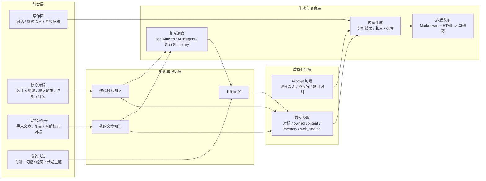
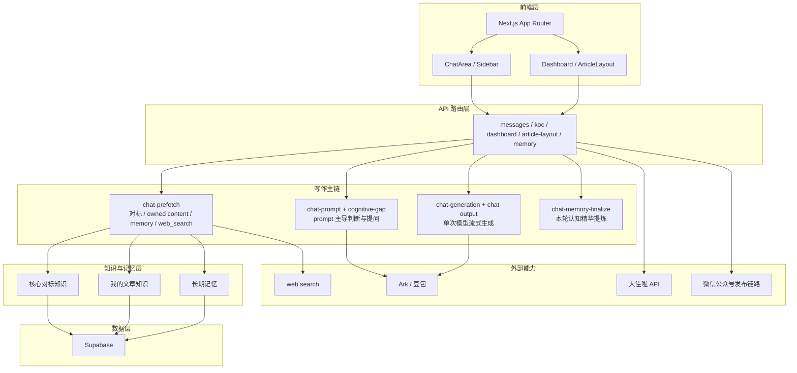
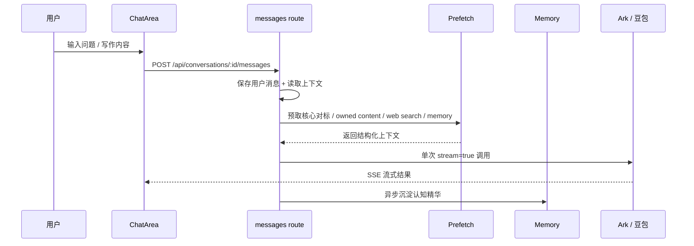

# Niche 架构说明

## 1. 当前真实架构结论

Niche 现在的真实架构，已经不适合再被描述成单纯的“AI 内容工作流工具”。

更准确地说，它正在从旧架构：

```text
导入对标 -> 分析 -> 选题 -> 成稿 -> 排版 -> 发布
```

迁移到新架构：

```text
写作前台
-> 单核心对标作为长期参照
-> 我的公众号作为复盘入口
-> memory 作为认知核心
-> 后台工具按需补知识 / 补证据 / 补上下文
```

所以当前最准确的形态是：

- **Writing-First**：写作是前台，不是 workflow 菜单
- **Memory-Centered**：memory 不只是配置，而是长期认知母本
- **Single-Benchmark-Oriented**：对标不是多 KOC 列表，而是单核心对象
- **Owned-Content-Backfed**：自己的公众号文章不仅复盘，还会反哺后续写作
- **Prompt-Led Orchestration**：少量规则兜底，主要依赖 prompt 驱动提问与生成

---

## 2. 当前产品主线

### 2.1 前台主线

当前用户真正感知到的主线应该被理解成：

```text
写
-> 看自己的复盘
-> 研究一个核心对标
-> 系统逐步记住你
```

而不是：

```text
选工作流
-> 跑一堆工具
-> 看分析面板
-> 再生成
```

### 2.2 后台主线

后台仍然有数据准备和能力编排，但目的已经变了：

- 不再让用户“感受到工具”
- 而是让工具默默为写作服务

后台主要负责：

- 拉核心对标知识
- 拉自己的公众号内容
- 必要时 web search
- 提炼对话认知精华
- 更新长期 memory

---

## 3. 核心系统分层

### 3.1 写作前台层

负责：

- 用户输入
- 持续写作
- 继续深入
- 直接成稿
- 排版与发布

核心文件：

- `components/chat/ChatArea.tsx`
- `app/api/conversations/[id]/messages/route.ts`
- `lib/chat-generation.ts`
- `lib/chat-output.ts`

### 3.2 对标层

负责：

- 当前核心对标是谁
- 导入核心对标
- 读取对标内容
- 后续围绕它做分析

核心文件：

- `components/sidebar/KOCListPanel.tsx`
- `app/api/koc/import/route.ts`
- `lib/koc-import.ts`
- `lib/knowledge-base.ts`

### 3.3 我的公众号层

负责：

- 配置自己的公众号
- 导入自己的文章与表现
- 生成复盘数据
- 与核心对标做差距对照

核心文件：

- `components/sidebar/DashboardPanel.tsx`
- `app/api/wechat/dashboard/route.ts`
- `app/(app)/journey/[id]/dashboard/page.tsx`

### 3.4 认知与 memory 层

负责：

- 沉淀长期判断
- 沉淀关键经历
- 沉淀未想透问题
- 沉淀长期主题
- 沉淀对标启发

核心文件：

- `lib/memory.ts`
- `lib/chat-memory-finalize.ts`
- `lib/agent/memory/session-memory.ts`

### 3.5 后台能力层

负责：

- 对标检索
- 自己文章检索
- web search
- 轻分析
- 微信发布

核心文件：

- `lib/chat-prefetch.ts`
- `lib/web-search.ts`
- `lib/agent/retrievers/owned-content.ts`
- `lib/agent/retrievers/competitor-content.ts`
- `lib/wechat-publish.ts`

---

## 4. 当前核心信息架构

当前产品应该被理解成 4 个主区：

### 4.1 写作区

主屏，负责：

- 用户表达
- AI 继续深入
- AI 直接生成

### 4.2 核心对标

不是列表，不是大盘，而是：

- 当前研究对象
- 它为什么能爆
- 它的爆款逻辑
- 你真正能学什么

### 4.3 我的公众号

前台偏复盘层：

- 我的文章表现
- 我 vs 核心对标的差距
- AI 洞察

但底层本质是知识层：

- 自己的文章会进入后续写作上下文

### 4.4 我的认知

不是 profile 配置，而是认知母本：

- 我反复在意的问题
- 我目前形成的判断
- 我还没想透的问题
- 我的关键经历
- 我的长期主题
- 当前核心对标
- 我从核心对标学到的可迁移资产

### 4.5 产品功能架构图


```mermaid
flowchart LR
    subgraph F["前台层"]
        A["写作区<br/>对话 / 继续深入 / 直接成稿"]
        B["核心对标<br/>为什么能爆 / 爆款逻辑 / 你能学什么"]
        C["我的公众号<br/>导入文章 / 复盘 / 对照核心对标"]
        D["我的认知<br/>判断 / 问题 / 经历 / 长期主题"]
    end

    subgraph G["生成与复盘层"]
        E["内容生成<br/>分析结果 / 长文 / 改写"]
        F2["排版发布<br/>Markdown -> HTML -> 草稿箱"]
        G2["复盘洞察<br/>Top Articles / AI Insights / Gap Summary"]
    end

    subgraph K["知识与记忆层"]
        H["核心对标知识"]
        I["我的文章知识"]
        J["长期记忆"]
    end

    subgraph S["后台补全层"]
        K2["Prompt 判断<br/>继续深入 / 直接写 / 缺口识别"]
        L["数据预取<br/>对标 / owned content / memory / web_search"]
    end

    A --> E
    B --> H
    C --> I
    D --> J
    H --> L
    I --> L
    J --> L
    K2 --> E
    L --> E
    E --> F2
    I --> G2
    H --> G2
    G2 --> J
```

### 4.6 产品技术架构图


```mermaid
flowchart TD
    subgraph UI["前端层"]
        A["Next.js App Router"]
        B["ChatArea / Sidebar"]
        C["Dashboard / ArticleLayout"]
    end

    subgraph API["API 路由层"]
        D["messages / koc / dashboard / article-layout / memory"]
    end

    subgraph CORE["写作主链"]
        E["chat-prefetch<br/>对标 / owned content / memory / web_search"]
        F["chat-prompt + cognitive-gap<br/>prompt 主导判断与提问"]
        G["chat-generation + chat-output<br/>单次模型流式生成"]
        H["chat-memory-finalize<br/>本轮认知精华提炼"]
    end

    subgraph KNOW["知识与记忆层"]
        I["核心对标知识"]
        J["我的文章知识"]
        K["长期记忆"]
    end

    subgraph EXT["外部能力"]
        L["Ark / 豆包"]
        M["大佳啦 API"]
        N["web search"]
        O["微信公众号发布链路"]
    end

    subgraph DB["数据层"]
        P["Supabase"]
    end

    A --> B
    A --> C
    B --> D
    C --> D
    D --> E
    D --> F
    D --> G
    D --> H
    E --> I
    E --> J
    E --> K
    E --> N
    F --> L
    G --> L
    D --> M
    D --> O
    I --> P
    J --> P
    K --> P
```

---

## 5. 对话主链

### 5.1 当前真实主链


```mermaid
sequenceDiagram
    participant U as 用户
    participant UI as ChatArea
    participant API as messages route
    participant PRE as Prefetch
    participant MEM as Memory
    participant LLM as Ark / 豆包

    U->>UI: 输入问题 / 写作内容
    UI->>API: POST /api/conversations/:id/messages
    API->>API: 保存用户消息 + 读取上下文
    API->>PRE: 预取核心对标 / owned content / web search / memory
    PRE-->>API: 返回结构化上下文
    API->>LLM: 单次 stream=true 调用
    LLM-->>UI: SSE 流式结果
    API->>MEM: 异步沉淀认知精华
```

### 5.2 与旧主链的差别

旧主链强调：

- 意图
- 工作流
- 生成结果

当前主链更强调：

- 当前这轮表达缺什么
- 是否需要继续深入
- 是否需要补事件知识
- 是否需要参考自己的文章和核心对标

---

## 6. prompt 与少量规则的关系

当前方向不是继续扩很多显式路由，而是：

- **少量 heuristic**
- **强 prompt**
- **AI 主动判断**

### 6.1 已保留的显式规则

显式规则主要还用在：

- 高频意图兜底
- 快捷路径
- 控制动作
- 必要的数据预取

相关文件：

- `lib/chat-intent-router.ts`
- `lib/chat-workflows.ts`
- `lib/chat-prefetch.ts`

### 6.2 当前更强调 prompt 的地方

prompt 主要负责：

- 判断是否先继续深入
- 对高认知密度写作做认知缺口识别
- 在分析核心对标时优先回答：
  - 它为什么能爆
  - 它的爆款逻辑是什么
  - 你真正能学什么
- 在用户表达明显空时，只问一句最关键的问题

相关文件：

- `lib/chat-prompt.ts`
- `lib/cognitive-gap.ts`

---

## 7. 认知缺口与继续深入

### 7.1 模型目标

现在不是“永远直接成稿”，而是：

- 先判断用户是否已经具备足够认知材料
- 如果不够，就继续深入
- 如果用户明确说“直接写”，可以跳过

### 7.2 当前缺口类型（v1）

当前缺口模型主要围绕：

- `judgment`：缺判断
- `anxiety`：缺焦虑对象
- `event`：缺事件抓手
- `personal`：缺个人性 / 真实经历
- `conflict`：缺冲突

### 7.3 当前原则

- 不一次砸很多问题
- 只问当前最关键的那一句
- 用户表达明显空时才问
- 用户明确要求直接写时，不强行打断

---

## 8. 数据预取架构

### 8.1 当前预取目标

当前 `chat-prefetch` 已不只是“对标分析工具链”，而是统一补这些上下文：

- 核心对标内容
- 自己公众号文章
- user / journey memory
- 必要的 web search

### 8.2 当前重要预取来源

#### 核心对标

- `koc_sources`
- `knowledge_articles`
- `knowledge_chunks`

#### 自己的公众号

- `owned_wechat_profiles`
- `owned_wechat_articles`

#### 长期记忆

- `user_memories`
- `journey_project_memories`
- `session_memory`

#### 外部网页

- `web_search`

### 8.3 关键变化

以前预取更像“围绕工作流”。

现在预取更像：

# 围绕“这个人 + 这个核心对标 + 这轮写作”补上下文

---

## 9. 核心对标架构

### 9.1 当前结构

- `journeys.primary_koc_source_id`
- `koc_sources`
- `knowledge_articles`

### 9.2 当前定位

核心对标不是“多个竞品中的一个”，而是：

- 当前唯一重点研究对象

### 9.3 当前产品语义

系统分析核心对标时，应该优先提供：

1. 它为什么能爆
2. 它的爆款逻辑是什么
3. 你真正能学什么

而不是停留在：

- 数字标题多
- 晚上发效果好
- 实测内容多

也就是说，核心对标层应该从“浅规律分析”升级为“资产研究”。

---

## 10. 我的公众号架构

### 10.1 当前导入链

```text
配置公众号名称
-> 创建 / 复用 owned_wechat_profiles
-> 调大佳啦接口拉历史文章
-> 获取文章统计 / 详情
-> 写入 owned_wechat_articles
-> 返回 dashboard summary / articles / ai_insights
```

### 10.2 当前详情页能力

当前详情页已经支持：

- 账号摘要
- 核心指标
- Top articles
- AI insights
- 与核心对标的对照复盘

### 10.3 当前真正价值

“我的公众号”表面上是复盘层，但底层最重要的是：

- 这些文章会被拿来做后续写作上下文
- 逐渐形成“你自己的高表现知识”

---

## 11. memory 架构

### 11.1 当前 memory 分层

#### session_memory

对话情景和过程记忆。

#### user_memories

用户长期认知记忆。

#### journey_project_memories

当前写作方向 / 项目策略记忆。

### 11.2 当前 finalize 逻辑

每轮对话结束后，不再只记录流程结果，而会先提炼：

- 本轮认知精华
- 候选判断
- 候选未想透问题
- 候选关键经历
- 候选长期主题
- 候选对标启发

再送入 compactor 更新 memory。

### 11.3 当前目标

不是单纯“记住聊过什么”，而是：

# 记住这个人到底形成了什么认知

---

## 12. 当前数据对象

### 对标与知识

- `journeys`
- `koc_sources`
- `knowledge_articles`
- `knowledge_chunks`

### 自己的公众号

- `owned_wechat_profiles`
- `owned_wechat_articles`

### 记忆

- `session_memory`
- `user_memories`
- `journey_project_memories`

### 视频号

- `wxvideo_sources`
- `wxvideo_posts`

---

## 13. 当前仍保留但应后台化的能力

这些能力依然重要，但不再适合作为前台主心智：

- `analyze_journey_data`
- `analyze_wxvideo_data`
- `analyze_publish_timing`
- 热点搜索
- 外部搜索
- 子生成器

它们更适合作为：

- 数据 enrich
- 证据补充
- 分析底座

而不是产品卖点。

---

## 14. 当前架构中的主要矛盾

### 14.1 文档世界观仍然偏旧

当前 `README.md` / `ARCHITECTURE.md` 旧版仍然偏：

- AI 内容工作流
- 多意图路由
- 对标导入 + 选题 + 成稿

而现在真实代码已经更偏：

- 写作
- 核心对标
- 我的公众号
- 我的认知

### 14.2 workflow 仍存在，但不该再主导产品叙事

`chat-workflows.ts`、`ChatIntent` 仍然存在，这是正常的。

但产品层已经不应该继续强调：

- “我有多少条 workflow”
- “我能调多少工具”

### 14.3 核心对标与我的公众号还有继续做深空间

现在已经有底座，但还缺：

- 核心对标详情页
- 自己高表现文章规律沉淀
- 用户自己的高表现母题进入 memory

---

## 15. 当前最值得继续做

### P1

统一所有文档和文案世界观。

### P2

做核心对标详情页，把“研究一个对象”做深。

### P3

继续把“我的公众号”从复盘页做成知识层入口。

### P4

把高表现文章规律回写到 memory 与写作上下文。

### P5

继续减少显式 intent 复杂度，让 prompt 主导行为更稳定。

---

## 16. 当前架构一句话总结

> Niche 当前的真实架构，是一个以写作为前台、以单核心对标为参照、以我的公众号为复盘入口、以 memory 为认知核心、以后台数据能力静默补上下文的创作者系统。
