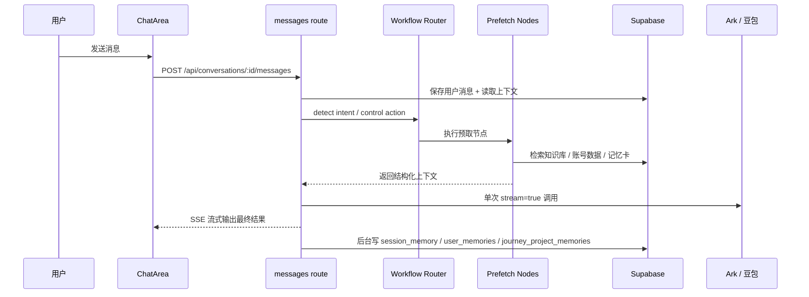

# Niche 架构说明

## 1. 当前真实架构

Niche 现在更准确的形态是：

- **Workflow-Driven 工作流驱动架构** —— 意图路由 + 工作流定义 + 单次模型调用
- Pattern-first 内容工作流引擎
- 单次模型真流式输出
- 记忆驱动
- 内容工作流产品

它不是一个”任意自由规划的万能智能体”，当前最稳定的是内容生产主链和显式工作流路由。

## 2. 当前产品主链

```text
导入对标公众号
-> 建立知识库
-> 分析规律
-> 生成选题
-> 生成完整稿
-> 排版
-> 发布到公众号草稿箱
```

## 3. 工作流驱动架构（新）

### 3.1 架构概览

当前采用 **Workflow-Driven Architecture（工作流驱动架构）**：

```
用户消息
    ↓
[chat-intent-router] → 识别意图 (topics/full_article/fast_generation...)
    ↓
[chat-workflows] → 获取工作流定义 (historyLimit + prefetch + generation)
    ↓
[chat-prefetch] → 并行执行数据预取 (journey_analysis, knowledge_refs...)
    ↓
[chat-prompt] → 构建 compact prompt (用户卡 + 项目卡 + 数据卡 + 意图指令)
    ↓
[chat-generation] → 单次模型流式调用 → 直出结果
    ↓
[chat-output] → 格式化输出
    ↓
[chat-memory-finalize] → 异步沉淀长期记忆
[chat-workflow-state] → 持久化工作流状态 (latest_topics, latest_full_article)
```

### 3.2 核心模块职责

| 模块 | 文件 | 职责 |
|------|------|------|
| Intent Router | `lib/chat-intent-router.ts` | 10 种意图识别、控制动作检测、历史长度配置 |
| Workflow Registry | `lib/chat-workflows.ts` | 10 种工作流定义（CHAT_WORKFLOWS） |
| Prefetch Engine | `lib/chat-prefetch.ts` | 数据预取并行执行、工具调用观测 |
| Prompt Builder | `lib/chat-prompt.ts` | Compact prompt 构建、意图指令生成 |
| Generation Engine | `lib/chat-generation.ts` | 单次流式生成、确定性降级响应 |
| Output Formatter | `lib/chat-output.ts` | 输出格式化、fallback 消息构建 |
| Memory Finalizer | `lib/chat-memory-finalize.ts` | 异步沉淀长期记忆 |
| Workflow State | `lib/chat-workflow-state.ts` | 工作流状态持久化 |
| Runtime Types | `lib/chat-runtime.ts` | 共享类型定义 |

### 3.3 工作流定义示例

```typescript
// CHAT_WORKFLOWS: Record<ChatIntent, WorkflowDefinition>
const CHAT_WORKFLOWS = {
  topics: {
    intent: “topics”,
    historyLimit: 2,
    prefetch: [“journey_analysis”],
    generation: “topics_output”
  },
  full_article: {
    intent: “full_article”,
    historyLimit: 3,
    prefetch: [“journey_analysis”, “knowledge_refs”, “semantic_refs”],
    generation: “article_output”
  },
  // ... 共 10 种工作流
}
```

### 3.4 预取节点清单

| 节点名称 | 对应工具 | 说明 |
|----------|----------|------|
| `journey_analysis` | `analyze_journey_data` | 分析旅程样本数据 |
| `wxvideo_analysis` | `analyze_wxvideo_data` | 分析视频号样本数据 |
| `publish_timing` | `analyze_publish_timing` | 分析最佳发布时间 |
| `knowledge_refs` | `searchJourneyKnowledge` | 检索知识库 |
| `semantic_refs` | `retrieveSemanticCompetitorContent` | 语义检索竞品内容 |
| `import_koc` | `import_koc_by_name` | 导入对标账号 |

### 3.5 意图清单（ChatIntent）

| 意图 | 触发条件 | 工作流特点 |
|------|----------|------------|
| `topics` | 选题/方向/写什么 | 预取 journey_analysis |
| `full_article` | 写稿/成稿/完整稿 | 预取 journey + knowledge + semantic |
| `fast_generation` | 重写/润色/随意写 | 无预取，直接生成 |
| `publish_timing` | 几点发/发布时间 | 预取 publish_timing |
| `growth_analysis` | 增长规律/爆款分析 | 预取 journey + wxvideo + timing |
| `wxvideo_analysis` | 视频号分析 | 预取 wxvideo + timing |
| `video_script` | 视频脚本/口播稿 | 预取 wxvideo |
| `import_koc_analysis` | 导入对标账号 | 预取 import_koc + journey + timing |
| `general` | 其他 | 无预取，通用回答 |

## 3. 系统分层

### 前端
- Next.js App Router
- `components/chat/ChatArea.tsx`
- `components/chat/ArticleLayoutPanel.tsx`
- `app/(app)/journey/[id]/koc/page.tsx`

### API 路由
- `app/api/conversations/[id]/messages/route.ts`
- `app/api/koc/*`
- `app/api/article-layout/*`
- `app/api/wechat/*`
- `app/api/memory/*`

### 业务层
- `lib/koc-import.ts`
- `lib/wxvideo-import.ts`
- `lib/knowledge-base.ts`
- `lib/hot-topic-search.ts`
- `lib/wechat-publish.ts`
- `lib/article-layout.ts`

### Agent / LLM
- `lib/llm.ts`
- `lib/chat-intent-router.ts`
- `lib/chat-workflows.ts`
- `lib/chat-prefetch.ts`
- `lib/chat-prompt.ts`
- `lib/chat-generation.ts`
- `lib/chat-output.ts`

### 记忆层
- `lib/memory.ts`
- `lib/agent/memory/session-memory.ts`

### 数据层
- Supabase
- `koc_sources`
- `knowledge_articles`
- `knowledge_chunks`
- `session_memory`
- `user_memories`
- `journey_project_memories`
- `wxvideo_sources`
- `wxvideo_posts`

## 4. 对话主链


```mermaid
sequenceDiagram
    participant U as 用户
    participant UI as ChatArea
    participant API as messages route
    participant WF as Workflow Router
    participant DATA as Prefetch Nodes
    participant DB as Supabase
    participant LLM as Ark / 豆包

    U->>UI: 发送消息
    UI->>API: POST /api/conversations/:id/messages
    API->>DB: 保存用户消息 + 读取上下文
    API->>WF: detect intent / control action
    WF->>DATA: 执行预取节点
    DATA->>DB: 检索知识库 / 账号数据 / 记忆卡
    DATA-->>API: 返回结构化上下文
    API->>LLM: 单次 stream=true 调用
    API-->>UI: SSE 流式输出最终结果
    API->>DB: 后台写 session_memory / user_memories / journey_project_memories
```

关键原则：

1. 默认只调用一次模型
2. memory 总结只做后台沉淀
3. 用户输出链和 memory 链彻底分开
4. 控制动作优先本地短路，不进入模型

## 5. 工具体系

当前主预取节点 / 数据能力：

- `analyze_journey_data`
- `analyze_wxvideo_data`
- `analyze_publish_timing`
- `search_knowledge_base`
- `retrieveSemanticCompetitorContent`
- `import_koc_by_name`

说明：
- `compliance_check` 已不参与聊天主流程

## 6. 输出体系

### 产物型输出
下面这些结果都走：

`意图路由 -> 数据预取 -> 单次模型流式输出`

- 选题结果
- 完整稿
- 发布时间建议
- 爆款规律分析
- 视频脚本

### 排版识别
完整稿输出后，前端通过：
- `lib/article-layout.ts`

识别出：
- 标题
- 摘要
- 正文

再进入：
- `ArticleLayoutPanel`

## 7. 记忆体系

### 工作记忆
- 当前对话 messages

### 情景记忆
- `session_memory`
- 工具调用、结果、观察、反思

### 长期记忆
- `user_memories`
- `journey_project_memories`

当前原则：
- 原始事实尽量保留
- 摘要压缩放后台
- 不让 memory summary 参与用户最终回答

## 8. 知识库体系

### 公众号内容
- `koc_sources`
- `knowledge_articles`
- `knowledge_chunks`

### 检索方式
- 关键词检索
- 向量召回
- 混合结果重排

## 9. 视频号增量架构

当前视频号不是独立入口，而是从公众号导入链自然扩展：

```text
公众号名称
-> 公众号导入
-> 拿到 ghid
-> history_by_ghid
-> 发现绑定视频号
-> 拉视频号作品列表
-> 拉互动指标
-> 写入 wxvideo_sources / wxvideo_posts
```

对应文件：
- `lib/dajiala.ts`
- `lib/wxvideo-import.ts`
- `supabase/migrations/020_add_wxvideo_tables.sql`

## 10. 当前风险点

1. `generate_full_article` 仍然是重工具
2. 路由里仍有较多快捷路径规则
3. 测试覆盖还薄
4. 视频号能力刚接底座，页面体验还在补

## 11. 当前最值得继续优化的方向

1. 稳定“写稿 -> 排版 -> 发布”
2. 补最小测试，防止回归
3. 把视频号状态和分析接进页面与聊天
