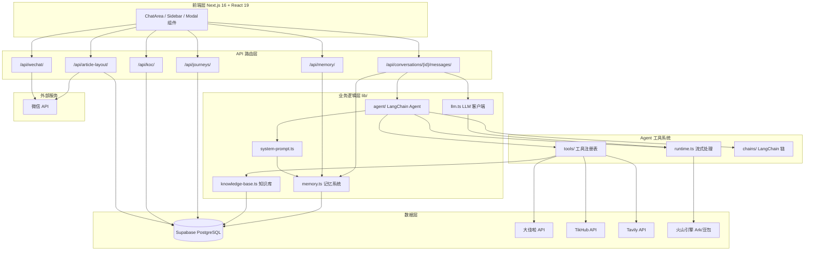
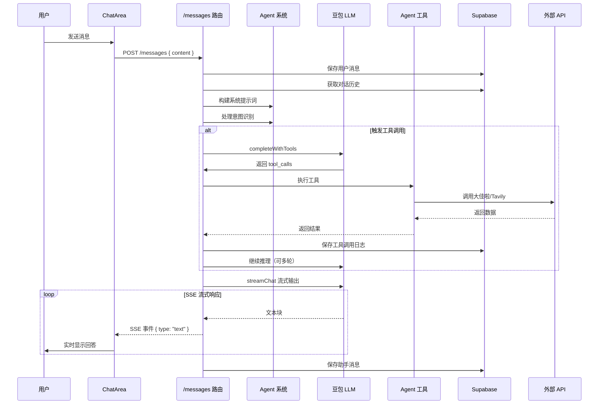
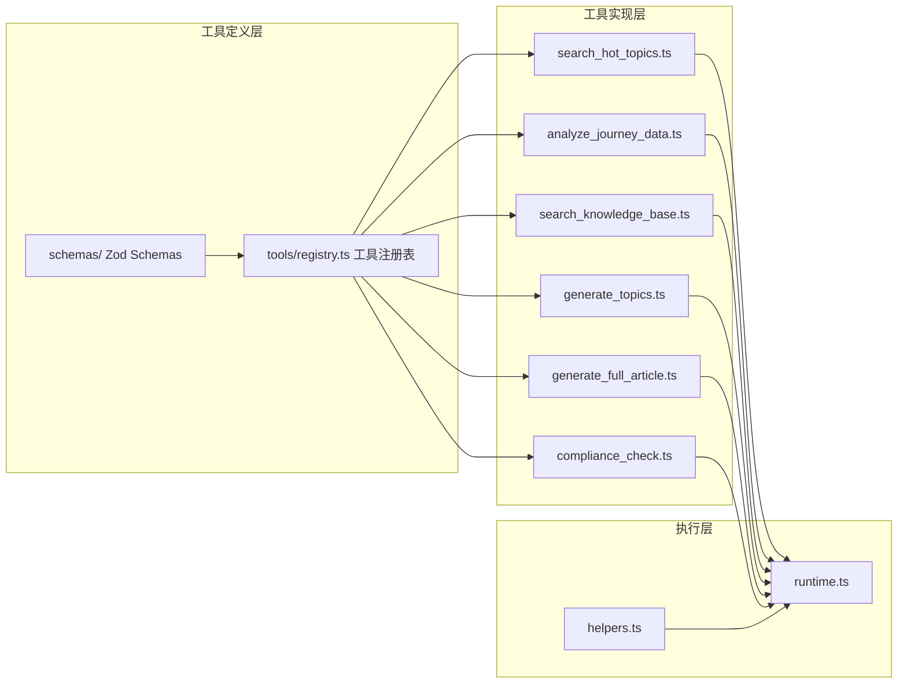
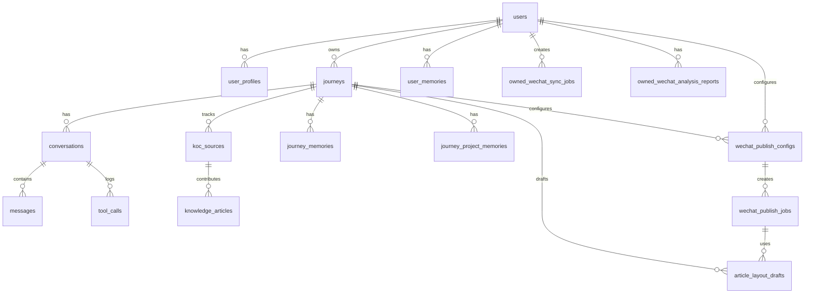
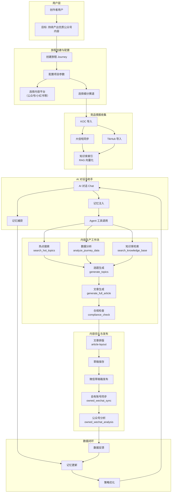
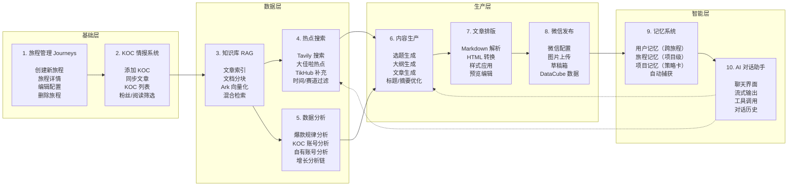
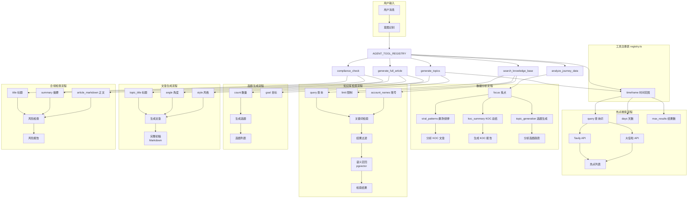
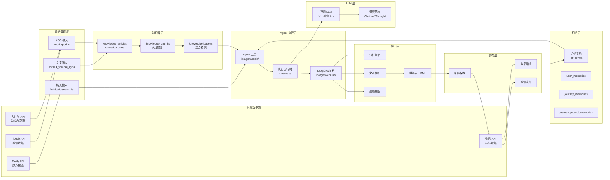

# Niche 项目技术架构图

## 一、整体架构（Mermaid）


```mermaid
graph TB
    subgraph "前端层 Next.js 16 + React 19"
        UI[ChatArea / Sidebar / Modal 组件]
    end

    subgraph "API 路由层"
        MSG["/api/conversations/{id}/messages/"]
        JOURNEY["/api/journeys/"]
        KOC["/api/koc/"]
        LAYOUT["/api/article-layout/"]
        WECHAT["/api/wechat/"]
        MEMORY["/api/memory/"]
    end

    subgraph "业务逻辑层 lib/"
        LLM[llm.ts LLM 客户端]
        AGENT[agent/ LangChain Agent]
        SYSTEM[system-prompt.ts]
        MEMORY_SYS[memory.ts 记忆系统]
        KB[knowledge-base.ts 知识库]
    end

    subgraph "Agent 工具系统"
        TOOLS[tools/ 工具注册表]
        RUNTIME[runtime.ts 流式处理]
        CHAINS[chains/ LangChain 链]
    end

    subgraph "数据层"
        SUPABASE[(Supabase PostgreSQL)]
        DJLLA[大佳啦 API]
        TIKHUB[TikHub API]
        TAVILY[Tavily API]
        ARK[火山引擎 Ark/豆包]
    end

    subgraph "外部服务"
        WECHAT_EXT[微信 API]
    end

    UI --> MSG
    UI --> JOURNEY
    UI --> KOC
    UI --> LAYOUT
    UI --> WECHAT
    UI --> MEMORY

    MSG --> LLM
    MSG --> AGENT
    MSG --> MEMORY_SYS

    MEMORY --> MEMORY_SYS

    LLM --> RUNTIME
    AGENT --> RUNTIME
    AGENT --> TOOLS
    AGENT --> SYSTEM
    AGENT --> CHAINS

    SYSTEM --> MEMORY_SYS

    RUNTIME --> ARK
    TOOLS --> KB
    TOOLS --> DJLLA
    TOOLS --> TIKHUB
    TOOLS --> TAVILY

    MEMORY_SYS --> SUPABASE
    KB --> SUPABASE
    JOURNEY --> SUPABASE
    KOC --> SUPABASE

    LAYOUT --> SUPABASE
    LAYOUT --> WECHAT_EXT
    WECHAT --> WECHAT_EXT
```

## 二、数据流向图

### 用户消息处理流程


```mermaid
sequenceDiagram
    participant U as 用户
    participant UI as ChatArea
    participant API as /messages 路由
    participant AGENT as Agent 系统
    participant LLM as 豆包 LLM
    participant TOOLS as Agent 工具
    participant DB as Supabase
    participant EXT as 外部 API

    U->>UI: 发送消息
    UI->>API: POST /messages { content }
    API->>DB: 保存用户消息
    API->>DB: 获取对话历史
    API->>AGENT: 构建系统提示词
    API->>AGENT: 处理意图识别

    alt 触发工具调用
        API->>LLM: completeWithTools
        LLM->>API: 返回 tool_calls
        API->>TOOLS: 执行工具
        TOOLS->>EXT: 调用大佳啦/Tavily
        EXT-->>TOOLS: 返回数据
        TOOLS-->>API: 返回结果
        API->>DB: 保存工具调用日志
        API->>LLM: 继续推理（可多轮）
    end

    API->>LLM: streamChat 流式输出
    loop SSE 流式响应
        LLM-->>API: 文本块
        API-->>UI: SSE 事件 { type: "text" }
        UI->>U: 实时显示回答
    end

    API->>DB: 保存助手消息
```

## 三、Agent 工具系统架构


```mermaid
graph LR
    subgraph "工具定义层"
        SCHEMAS[schemas/ Zod Schemas]
        DEFINITIONS[tools/registry.ts 工具注册表]
    end

    subgraph "工具实现层"
        T1[search_hot_topics.ts]
        T2[analyze_journey_data.ts]
        T3[search_knowledge_base.ts]
        T4[generate_topics.ts]
        T5[generate_full_article.ts]
        T6[compliance_check.ts]
    end

    subgraph "执行层"
        RUNTIME[runtime.ts]
        HELPERS[helpers.ts]
    end

    SCHEMAS --> DEFINITIONS
    DEFINITIONS --> T1
    DEFINITIONS --> T2
    DEFINITIONS --> T3
    DEFINITIONS --> T4
    DEFINITIONS --> T5
    DEFINITIONS --> T6

    T1 --> RUNTIME
    T2 --> RUNTIME
    T3 --> RUNTIME
    T4 --> RUNTIME
    T5 --> RUNTIME
    T6 --> RUNTIME

    HELPERS --> RUNTIME
```

## 四、数据库 Schema 关系


```mermaid
erDiagram
    users ||--o{ user_profiles : has
    users ||--o{ journeys : owns
    users ||--o{ user_memories : has

    journeys ||--o{ conversations : has
    journeys ||--o{ koc_sources : tracks
    journeys ||--o{ journey_memories : has
    journeys ||--o{ journey_project_memories : has
    journeys ||--o{ article_layout_drafts : drafts
    journeys ||--o{ wechat_publish_configs : configures

    conversations ||--o{ messages : contains
    conversations ||--o{ tool_calls : logs

    koc_sources ||--o{ knowledge_articles : contributes

    users ||--o{ wechat_publish_configs : configures
    wechat_publish_configs ||--o{ wechat_publish_jobs : creates
    wechat_publish_jobs ||--o{ article_layout_drafts : uses

    users ||--o{ owned_wechat_sync_jobs : creates
    users ||--o{ owned_wechat_analysis_reports : has
```

## 五、关键模块详细关系

### LLM 调用链路

```
用户消息
    │
    ▼
┌───────────────────────────────────────┐
│  app/api/conversations/[id]/messages/ │
│  - 意图识别 (resolveUserIntentChain)   │
│  - 焦点解析 (resolveSearchFocusChain)  │
│  - 自然语言跟进处理                     │
│  - 工具执行循环                         │
└───────────────────────────────────────┘
    │
    ├──────────────────────────────────┐
    │                                  │
    ▼                                  ▼
┌───────────────┐            ┌─────────────────┐
│ lib/llm.ts    │            │ lib/agent/      │
│ (统一接口)    │            │                 │
│               │            │                 │
│ - streamChat  │◄───────────┤ models.ts       │
│ - chat        │            │ - 模型工厂      │
│ - complete    │            │ - ChatOpenAI    │
└───────────────┘            └─────────────────┘
                                      │
                                      ▼
                            ┌─────────────────┐
                            │ runtime.ts      │
                            │                 │
                            │ - streamText    │
                            │ - invokeText    │
                            │ - invokeTools   │
                            └─────────────────┘
                                      │
                                      ▼
                            ┌─────────────────┐
                            │ 火山引擎 Ark    │
                            │ Chat API        │
                            │                 │
                            │ 深度思考 (可选) │
                            └─────────────────┘
```

### 知识库架构（向量 RAG 版本）

```
┌─────────────────────────────────────────────────────────────────┐
│                      RAG 知识库系统                              │
├─────────────────────────────────────────────────────────────────┤
│                                                                 │
│  ┌──────────────┐      ┌────────────────────┐                  │
│  │ koc_sources  │      │ knowledge_articles │                  │
│  │              │      │                    │                  │
│  │ - 账号名     │◄────►│ - 标题             │                  │
│  │ - ghid       │      │ - 内容             │                  │
│  │ - 粉丝数     │      │ - 阅读数           │                  │
│  │ - 头像       │      │ - source_type      │                  │
│  └──────────────┘      │ (competitor/      │                  │
│                        │  wechat_hot/       │                  │
│                        │  owned)            │                  │
│                        └────────────────────┘                  │
│                                   │                            │
│                                   │ 索引流程                    │
│                                   ▼                            │
│  ┌────────────────────────────────────────────────────────┐   │
│  │  lib/rag/llamaindex/                                    │   │
│  │                                                         │   │
│  │  documents.ts - 文档分块                                │   │
│  │  ├── SentenceSplitter (420 char / 60 overlap)          │   │
│  │  └── LlamaIndex Document 构建                           │   │
│  │                                                         │   │
│  │  ark-embeddings.ts - 向量生成                           │   │
│  │  ├── Ark Embeddings API                                 │   │
│  │  ├── Model: doubao-embedding-vision-251215              │   │
│  │  ├── Batch limit: 4                                     │   │
│  │  └── Dimensions: 1024                                   │   │
│  │                                                         │   │
│  │  ingest.ts - 索引写入                                   │   │
│  │  ├── 清理旧 chunks (按 source_id + model)              │   │
│  │  ├── 生成 embeddings (批处理)                           │   │
│  │  ├── 写入 knowledge_chunks 表                           │   │
│  │  └── content_hash 去重                                  │   │
│  └────────────────────────────────────────────────────────┘   │
│                                   │                            │
│                                   ▼                            │
│  ┌────────────────────────────────────────────────────────┐   │
│  │  knowledge_chunks 表                                   │   │
│  │                                                         │   │
│  │  - source_type: competitor/wechat_hot/owned            │   │
│  │  - source_table: knowledge_articles/owned_articles      │   │
│  │  - chunk_index: 分块序号                                │   │
│  │  - chunk_text: 分块文本                                 │   │
│  │  - embedding: vector(1024) Ark 向量                     │   │
│  │  - embedding_model: doubao-embedding-vision-251215     │   │
│  │  - content_hash: SHA256 内容哈希                       │   │
│  │  - read_count: 文章阅读数（用于排序）                   │   │
│  └────────────────────────────────────────────────────────┘   │
│                                   │                            │
│                                   │ 检索流程                    │
│                                   ▼                            │
│  ┌────────────────────────────────────────────────────────┐   │
│  │  lib/knowledge-base.ts (混合检索)                       │   │
│  │                                                         │   │
│  │  1. 关键词检索                                           │   │
│  │     ├── 标题/摘要/内容 LIKE 匹配                         │   │
│  │     └── 按阅读数倒序排序                                │   │
│  │                                                         │   │
│  │  2. 账号过滤                                             │   │
│  │     └── 按指定账号名称过滤结果                           │   │
│  │                                                         │   │
│  │  3. 语义召回 (当关键词结果不足时)                         │   │
│  │     └── retrieve.ts                                      │   │
│  │         ├── embedQuery 生成查询向量                      │   │
│  │         ├── pgvector 余弦相似度搜索                      │   │
│  │         ├── match_knowledge_chunks RPC                  │   │
│  │         └── minSimilarity: 0.25 过滤阈值                │   │
│  │                                                         │   │
│  │  4. 结果合并 & 重排                                      │   │
│  │     ├── 去重 (按 source_id)                             │   │
│  │     ├── 按阅读数倒序排序                                │   │
│  │     └── 生成 excerpt 摘要                               │   │
│  └────────────────────────────────────────────────────────┘   │
│                                                                 │
│  数据源：                                                       │
│  • 大佳啦 API → knowledge_articles → 知识库索引               │
│  • TikHub API → 补充数据                                       │
│  • 自有账号同步 → owned_wechat_articles → 知识库索引          │
│                                                                 │
└─────────────────────────────────────────────────────────────────┘
```

### 向量检索调用链路

```
用户查询
    │
    ▼
┌─────────────────────────────────────┐
│  lib/knowledge-base.ts              │
│  searchJourneyKnowledge()            │
└─────────────────────────────────────┘
    │
    ├─────────────────────────────────┐
    │                                  │
    ▼                                  ▼
┌──────────────────┐          ┌────────────────────────┐
│ 关键词检索        │          │ 账号过滤              │
│ (LIKE 查询)       │          │ (koc_sources 表)      │
└──────────────────┘          └────────────────────────┘
    │                                  │
    └────────────────┬─────────────────┘
                     │
                     ▼
              结果数量 < limit？
                     │
          ┌──────────┴──────────┐
          │ 是                  │ 否
          ▼                     │
  ┌────────────────────┐        │
  │ 语义召回            │        │
  │ (retrieve.ts)       │        │
  └────────────────────┘        │
          │                     │
          ▼                     │
  ┌────────────────────┐        │
  │ Ark Embeddings API │        │
  │ embedQuery()       │        │
  └────────────────────┘        │
          │                     │
          ▼                     │
  ┌────────────────────┐        │
  │ pgvector 搜索       │        │
  │ match_knowledge_   │        │
  │ chunks RPC         │        │
  └────────────────────┘        │
          │                     │
          └──────────┬──────────┘
                     ▼
          ┌────────────────────┐
          │ 结果合并 & 去重     │
          │ 按阅读数重排        │
          │ 生成 excerpt        │
          └────────────────────┘

## 六、技术栈清单

### 前端
| 技术 | 版本 | 用途 |
|------|------|------|
| Next.js | 16.2.4 | App Router 框架 |
| React | 19.2.4 | UI 库 |
| TypeScript | 5.x | 类型系统 |
| Ant Design | 6.3.6 | UI 组件库 |
| Ant Design X | 2.5.0 | 聊天组件 |
| Tailwind CSS | 4.x | 样式系统 |
| Day.js | 1.11.20 | 日期处理 |
| Sonner | 2.0.7 | Toast 通知 |

### 后端
| 技术 | 版本 | 用途 |
|------|------|------|
| Node.js | - | 运行时 |
| LangChain | 1.3.4 | Agent 框架 |
| LangGraph | 1.2.9 | 工作流编排 |
| OpenAI SDK | - | API 客户端 |
| Zod | 4.3.6 | Schema 验证 |

### 数据与基础设施
| 技术 | 用途 |
|------|------|
| Supabase PostgreSQL | 主数据库 |
| pgvector | 向量搜索 |
| 火山引擎 Ark | LLM API |
| 大佳啦 API | 微信公众号数据 |
| TikHub API | 微信数据补充 |
| Tavily API | 网络搜索 |
| LangSmith | 可观测性 |

### 微信生态
| 组件 | 说明 |
|------|------|
| wechat-publish.ts | 微信草稿箱发布 |
| wechat-owned-analysis.ts | 自有公众号分析 |
| article-layout.ts | Markdown → 微信 HTML |
| wechat-gateway/ | 可选的微信 API 代理 |

## 七、产品功能架构

### 核心用户旅程


```mermaid
graph TB
    subgraph "用户层"
        USER[创作者用户]
        GOAL["目标: 持续产出优质公众号内容"]
    end

    subgraph "旅程创建与配置"
        J_CREATE["创建旅程 Journey"]
        J_CONFIG["配置项目参数"]
        C_PLATFORM["选择内容平台<br/>（公众号/小红书等）"]
        C_TRACK["选择细分赛道"]
    end

    subgraph "竞品情报收集"
        KOC_IMPORT["KOC 导入"]
        DJL_SYNC["大佳啦同步"]
        KH_IMPORT["TikHub 导入"]
        KB_INDEX["知识库索引<br/>RAG 向量化"]
    end

    subgraph "AI 对话与助手"
        CHAT["AI 对话 Chat"]
        MEM_INJECT["记忆注入"]
        MEM_CAPTURE["记忆捕获"]
        TOOL_CALL["Agent 工具调用"]
    end

    subgraph "内容生产工作流"
        HOT_SEARCH["热点搜索<br/>search_hot_topics"]
        DATA_ANALYSIS["数据分析<br/>analyze_journey_data"]
        KB_SEARCH["知识库检索<br/>search_knowledge_base"]
        TOPIC_GEN["选题生成<br/>generate_topics"]
        ARTICLE_GEN["文章生成<br/>generate_full_article"]
        COMP_CHECK["合规检查<br/>compliance_check"]
    end

    subgraph "内容优化与发布"
        LAYOUT["文章排版<br/>article-layout"]
        DRAFT_SAVE["草稿保存"]
        WC_PUBLISH["微信草稿箱发布"]
        DATA_SYNC["自有账号同步<br/>owned_wechat_sync"]
        ANALYSIS["公众号分析<br/>owned_wechat_analysis"]
    end

    subgraph "数据闭环"
        FEEDBACK["数据反馈"]
        MEM_UPDATE["记忆更新"]
        IMPROVE["策略优化"]
    end

    USER --> GOAL
    GOAL --> J_CREATE
    J_CREATE --> J_CONFIG
    J_CONFIG --> C_PLATFORM
    J_CONFIG --> C_TRACK
    C_TRACK --> KOC_IMPORT

    KOC_IMPORT --> DJL_SYNC
    KOC_IMPORT --> KH_IMPORT
    DJL_SYNC --> KB_INDEX
    KH_IMPORT --> KB_INDEX

    KB_INDEX --> CHAT

    CHAT --> MEM_INJECT
    MEM_INJECT --> TOOL_CALL
    TOOL_CALL --> HOT_SEARCH
    TOOL_CALL --> DATA_ANALYSIS
    TOOL_CALL --> KB_SEARCH

    HOT_SEARCH --> TOPIC_GEN
    DATA_ANALYSIS --> TOPIC_GEN
    KB_SEARCH --> TOPIC_GEN

    TOPIC_GEN --> ARTICLE_GEN
    ARTICLE_GEN --> COMP_CHECK
    COMP_CHECK --> LAYOUT

    LAYOUT --> DRAFT_SAVE
    DRAFT_SAVE --> WC_PUBLISH
    WC_PUBLISH --> DATA_SYNC
    DATA_SYNC --> ANALYSIS

    ANALYSIS --> FEEDBACK
    CHAT --> MEM_CAPTURE
    MEM_CAPTURE --> MEM_UPDATE
    FEEDBACK --> MEM_UPDATE
    MEM_UPDATE --> IMPROVE
    IMPROVE --> CHAT
```

### 功能模块详细图


```mermaid
graph LR
    subgraph "基础层"
        G1["1. 旅程管理 Journeys<br/><br/>创建新旅程<br/>旅程详情<br/>编辑配置<br/>删除旅程"]
        G2["2. KOC 情报系统<br/><br/>添加 KOC<br/>同步文章<br/>KOC 列表<br/>粉丝/阅读筛选"]
    end

    subgraph "数据层"
        G3["3. 知识库 RAG<br/><br/>文章索引<br/>文档分块<br/>Ark 向量化<br/>混合检索"]
        G4["4. 热点搜索<br/><br/>Tavily 搜索<br/>大佳啦热点<br/>TikHub 补充<br/>时间/赛道过滤"]
        G5["5. 数据分析<br/><br/>爆款规律分析<br/>KOC 账号分析<br/>自有账号分析<br/>增长分析链"]
    end

    subgraph "生产层"
        G6["6. 内容生产<br/><br/>选题生成<br/>大纲生成<br/>文章生成<br/>标题/摘要优化"]
        G7["7. 文章排版<br/><br/>Markdown 解析<br/>HTML 转换<br/>样式应用<br/>预览编辑"]
        G8["8. 微信发布<br/><br/>微信配置<br/>图片上传<br/>草稿箱<br/>DataCube 数据"]
    end

    subgraph "智能层"
        G9["9. 记忆系统<br/><br/>用户记忆（跨旅程）<br/>旅程记忆（项目级）<br/>项目记忆（策略卡）<br/>自动捕获"]
        G10["10. AI 对话助手<br/><br/>聊天界面<br/>流式输出<br/>工具调用<br/>对话历史"]
    end

    G1 --> G2
    G2 --> G3
    G3 --> G4
    G3 --> G5
    G4 --> G6
    G5 --> G6
    G6 --> G7
    G7 --> G8
    G8 --> G9
    G9 --> G10
    G10 -.-> G4
    G10 -.-> G6
```
    HOT_SEARCH --> HOT_DJL
    HOT_SEARCH --> HOT_KH

    HOT_SEARCH --> ANALYSIS_VIRAL
    KB_SEARCH --> ANALYSIS_KOC
    KOC_SYNC --> ANALYSIS_KOC
    ANALYSIS_KOC --> ANALYSIS_OWN
    ANALYSIS_OWN --> ANALYSIS_GROWTH

    ANALYSIS_VIRAL --> PROD_TOPIC
    ANALYSIS_KOC --> PROD_TOPIC
    KB_SEARCH --> PROD_TOPIC

    PROD_TOPIC --> PROD_OUTLINE
    PROD_OUTLINE --> PROD_ARTICLE
    PROD_ARTICLE --> PROD_TITLE
    PROD_ARTICLE --> PROD_SUMMARY

    PROD_ARTICLE --> LAYOUT_MD
    LAYOUT_MD --> LAYOUT_HTML
    LAYOUT_HTML --> LAYOUT_STYLES
    LAYOUT_STYLES --> LAYOUT_PREVIEW

    LAYOUT_PREVIEW --> WC_CONFIG
    WC_CONFIG --> WC_UPLOAD
    WC_UPLOAD --> WC_DRAFT
    WC_DRAFT --> WC_PUB
    WC_PUB --> WC_CUBE

    CHAT_UI --> MEM_CAPTURE
    MEM_CAPTURE --> MEM_USER
    MEM_CAPTURE --> MEM_JOURNEY
    MEM_CAPTURE --> MEM_PROJECT
    MEM_USER --> CHAT_UI
    MEM_JOURNEY --> CHAT_UI
    MEM_PROJECT --> CHAT_UI
```

### Agent 工具完整流程


```mermaid
graph TB
    subgraph "用户输入"
        INPUT["用户消息"]
        INTENT["意图识别"]
    end

    subgraph "工具注册表 registry.ts"
        REGISTRY["AGENT_TOOL_REGISTRY"]
        T1["search_hot_topics"]
        T2["analyze_journey_data"]
        T3["search_knowledge_base"]
        T4["generate_topics"]
        T5["generate_full_article"]
        T6["compliance_check"]
    end

    subgraph "热点搜索流程"
        T1 --> Q1["query 查询词"]
        T1 --> D1["days 天数"]
        T1 --> R1["max_results 结果数"]
        Q1 --> TV1["Tavily API"]
        Q1 --> DJ1["大佳啦 API"]
        TV1 --> RES1["热点列表"]
        DJ1 --> RES1
    end

    subgraph "数据分析流程"
        T2 --> FOCUS["focus 焦点"]
        FOCUS --> F1["viral_patterns 爆款规律"]
        FOCUS --> F2["koc_summary KOC 总结"]
        FOCUS --> F3["topic_generation 选题生成"]
        F1 --> AN1["分析 KOC 文章"]
        F2 --> AN2["生成 KOC 报告"]
        F3 --> AN3["分析选题趋势"]
    end

    subgraph "知识库检索流程"
        T3 --> Q2["query 查询"]
        T3 --> L1["limit 限制"]
        T3 --> ACC["account_names 账号"]
        Q2 --> KW["关键词检索"]
        ACC --> KW
        KW --> FIL1["结果过滤"]
        FIL1 --> VEC["语义召回<br/>pgvector"]
        VEC --> RES2["检索结果"]
    end

    subgraph "选题生成流程"
        T4 --> C1["count 数量"]
        T4 --> G1["goal 目标"]
        T4 --> T1["timeframe 时间范围"]
        C1 --> GENT["生成选题"]
        GENT --> TOP["选题列表"]
    end

    subgraph "文章生成流程"
        T5 --> TT["topic_title 标题"]
        T5 --> ANG["angle 角度"]
        T5 --> STY["style 风格"]
        TT --> GENA["生成文章"]
        ANG --> GENA
        STY --> GENA
        GENA --> ART["完整初稿<br/>Markdown"]
    end

    subgraph "合规检查流程"
        T6 --> TI["title 标题"]
        T6 --> SU["summary 摘要"]
        T6 --> AM["article_markdown 正文"]
        TI --> CHECK["风险检查"]
        SU --> CHECK
        AM --> CHECK
        CHECK --> RISK["风险报告"]
    end

    INPUT --> INTENT
    INTENT --> REGISTRY
    REGISTRY --> T1
    REGISTRY --> T2
    REGISTRY --> T3
    REGISTRY --> T4
    REGISTRY --> T5
    REGISTRY --> T6
```

### 数据流转全景图


```mermaid
graph LR
    subgraph "外部数据源"
        DJL["大佳啦 API<br/>公众号数据"]
        KH["TikHub API<br/>微信数据"]
        TV["Tavily API<br/>热点搜索"]
        WC["微信 API<br/>发布/数据"]
    end

    subgraph "数据摄取层"
        IMPORT["KOC 导入<br/>koc-import.ts"]
        SYNC["文章同步<br/>owned_wechat_sync"]
        SEARCH["热点搜索<br/>hot-topic-search.ts"]
    end

    subgraph "知识库层"
        ARTICLES["knowledge_articles<br/>owned_articles"]
        CHUNKS["knowledge_chunks<br/>向量索引"]
        KB["knowledge-base.ts<br/>混合检索"]
    end

    subgraph "记忆层"
        MEM["记忆系统<br/>memory.ts"]
        UM["user_memories"]
        JM["journey_memories"]
        PM["journey_project_memories"]
    end

    subgraph "Agent 执行层"
        TOOLS["Agent 工具<br/>lib/agent/tools/"]
        RUNTIME["执行运行时<br/>runtime.ts"]
        CHAINS["LangChain 链<br/>lib/agent/chains/"]
    end

    subgraph "LLM 层"
        MODEL["豆包 LLM<br/>火山引擎 Ark"]
        DEEP["深度思考<br/>Chain of Thought"]
    end

    subgraph "输出层"
        TOPICS["选题输出"]
        ARTICLES_OUT["文章输出"]
        ANALYSIS["分析报告"]
        LAYOUT["排版后 HTML"]
    end

    subgraph "发布层"
        DRAFT["草稿保存"]
        PUBLISH["微信发布"]
        METRICS["数据指标"]
    end

    DJL --> IMPORT
    KH --> IMPORT
    TV --> SEARCH

    IMPORT --> ARTICLES
    SYNC --> ARTICLES
    ARTICLES --> CHUNKS
    CHUNKS --> KB

    KB --> TOOLS
    SEARCH --> TOOLS
    MEM --> TOOLS

    TOOLS --> RUNTIME
    RUNTIME --> CHAINS
    RUNTIME --> MODEL
    MODEL --> DEEP

    CHAINS --> TOPICS
    CHAINS --> ARTICLES_OUT
    CHAINS --> ANALYSIS

    ARTICLES_OUT --> LAYOUT
    LAYOUT --> DRAFT
    DRAFT --> WC
    WC --> PUBLISH
    WC --> METRICS
    METRICS --> MEM
```

## 八、核心设计模式

### 1. Server Components 优先
```
页面: Server Component
  ├─ 加载初始数据
  └─ 客户端交互组件 (Client Component)
```

### 2. SSE 流式响应
```
API → ReadableStream → SSE Events → UI 实时更新
```

### 3. Agent 工具模式
```
Schema → Definition → Execution → Result
```

### 4. 记忆系统
```
用户记忆 + 旅程记忆 + 项目记忆 → 动态注入系统提示词
```

### 5. RLS 行级安全

```text
Supabase RLS → 用户数据隔离
```
