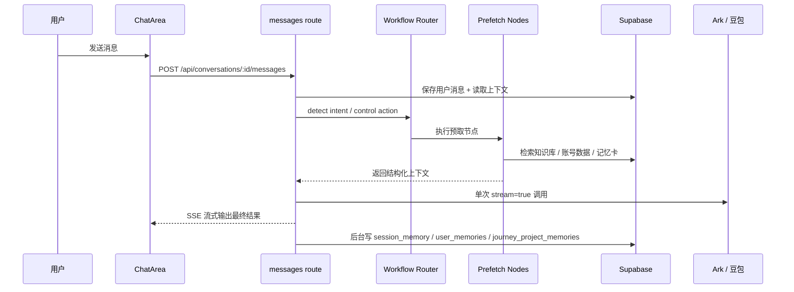

# Niche 架构说明

## 1. 当前真实架构

Niche 现在更准确的形态是：

- Pattern-first 内容工作流引擎
- 单次模型真流式输出
- 记忆驱动
- 内容工作流产品

它不是一个“任意自由规划的万能智能体”，当前最稳定的是内容生产主链和显式工作流路由。

## 2. 当前产品主链

```text
导入对标公众号
-> 建立知识库
-> 分析规律
-> 生成选题
-> 生成完整稿
-> 排版
-> 发布到公众号草稿箱
```

## 3. 系统分层

### 前端
- Next.js App Router
- `components/chat/ChatArea.tsx`
- `components/chat/ArticleLayoutPanel.tsx`
- `app/(app)/journey/[id]/koc/page.tsx`

### API 路由
- `app/api/conversations/[id]/messages/route.ts`
- `app/api/koc/*`
- `app/api/article-layout/*`
- `app/api/wechat/*`
- `app/api/memory/*`

### 业务层
- `lib/koc-import.ts`
- `lib/wxvideo-import.ts`
- `lib/knowledge-base.ts`
- `lib/hot-topic-search.ts`
- `lib/wechat-publish.ts`
- `lib/article-layout.ts`

### Agent / LLM
- `lib/llm.ts`
- `lib/chat-intent-router.ts`
- `lib/chat-workflows.ts`
- `lib/chat-prefetch.ts`
- `lib/chat-prompt.ts`
- `lib/chat-generation.ts`
- `lib/chat-output.ts`

### 记忆层
- `lib/memory.ts`
- `lib/agent/memory/session-memory.ts`

### 数据层
- Supabase
- `koc_sources`
- `knowledge_articles`
- `knowledge_chunks`
- `session_memory`
- `user_memories`
- `journey_project_memories`
- `wxvideo_sources`
- `wxvideo_posts`

## 4. 对话主链


```mermaid
sequenceDiagram
    participant U as 用户
    participant UI as ChatArea
    participant API as messages route
    participant WF as Workflow Router
    participant DATA as Prefetch Nodes
    participant DB as Supabase
    participant LLM as Ark / 豆包

    U->>UI: 发送消息
    UI->>API: POST /api/conversations/:id/messages
    API->>DB: 保存用户消息 + 读取上下文
    API->>WF: detect intent / control action
    WF->>DATA: 执行预取节点
    DATA->>DB: 检索知识库 / 账号数据 / 记忆卡
    DATA-->>API: 返回结构化上下文
    API->>LLM: 单次 stream=true 调用
    API-->>UI: SSE 流式输出最终结果
    API->>DB: 后台写 session_memory / user_memories / journey_project_memories
```

关键原则：

1. 默认只调用一次模型
2. memory 总结只做后台沉淀
3. 用户输出链和 memory 链彻底分开
4. 控制动作优先本地短路，不进入模型

## 5. 工具体系

当前主预取节点 / 数据能力：

- `analyze_journey_data`
- `analyze_wxvideo_data`
- `analyze_publish_timing`
- `search_knowledge_base`
- `retrieveSemanticCompetitorContent`
- `import_koc_by_name`

说明：
- `compliance_check` 已不参与聊天主流程

## 6. 输出体系

### 产物型输出
下面这些结果都走：

`意图路由 -> 数据预取 -> 单次模型流式输出`

- 选题结果
- 完整稿
- 发布时间建议
- 爆款规律分析
- 视频脚本

### 排版识别
完整稿输出后，前端通过：
- `lib/article-layout.ts`

识别出：
- 标题
- 摘要
- 正文

再进入：
- `ArticleLayoutPanel`

## 7. 记忆体系

### 工作记忆
- 当前对话 messages

### 情景记忆
- `session_memory`
- 工具调用、结果、观察、反思

### 长期记忆
- `user_memories`
- `journey_project_memories`

当前原则：
- 原始事实尽量保留
- 摘要压缩放后台
- 不让 memory summary 参与用户最终回答

## 8. 知识库体系

### 公众号内容
- `koc_sources`
- `knowledge_articles`
- `knowledge_chunks`

### 检索方式
- 关键词检索
- 向量召回
- 混合结果重排

## 9. 视频号增量架构

当前视频号不是独立入口，而是从公众号导入链自然扩展：

```text
公众号名称
-> 公众号导入
-> 拿到 ghid
-> history_by_ghid
-> 发现绑定视频号
-> 拉视频号作品列表
-> 拉互动指标
-> 写入 wxvideo_sources / wxvideo_posts
```

对应文件：
- `lib/dajiala.ts`
- `lib/wxvideo-import.ts`
- `supabase/migrations/020_add_wxvideo_tables.sql`

## 10. 当前风险点

1. `generate_full_article` 仍然是重工具
2. 路由里仍有较多快捷路径规则
3. 测试覆盖还薄
4. 视频号能力刚接底座，页面体验还在补

## 11. 当前最值得继续优化的方向

1. 稳定“写稿 -> 排版 -> 发布”
2. 补最小测试，防止回归
3. 把视频号状态和分析接进页面与聊天
