# Niche 项目技术架构图

## 一、整体架构（Mermaid）

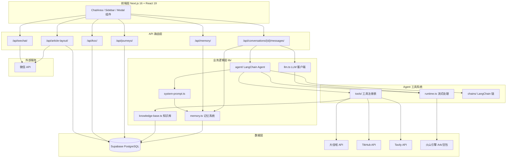
```mermaid
graph TB
    subgraph "前端层 Next.js 16 + React 19"
        UI[ChatArea / Sidebar / Modal 组件]
    end

    subgraph "API 路由层"
        MSG["/api/conversations/{id}/messages/"]
        JOURNEY["/api/journeys/"]
        KOC["/api/koc/"]
        LAYOUT["/api/article-layout/"]
        WECHAT["/api/wechat/"]
        MEMORY["/api/memory/"]
    end

    subgraph "业务逻辑层 lib/"
        LLM[llm.ts LLM 客户端]
        AGENT[agent/ LangChain Agent]
        SYSTEM[system-prompt.ts]
        MEMORY_SYS[memory.ts 记忆系统]
        KB[knowledge-base.ts 知识库]
    end

    subgraph "Agent 工具系统"
        TOOLS[tools/ 工具注册表]
        RUNTIME[runtime.ts 流式处理]
        CHAINS[chains/ LangChain 链]
    end

    subgraph "数据层"
        SUPABASE[(Supabase PostgreSQL)]
        DJLLA[大佳啦 API]
        TIKHUB[TikHub API]
        TAVILY[Tavily API]
        ARK[火山引擎 Ark/豆包]
    end

    subgraph "外部服务"
        WECHAT_EXT[微信 API]
    end

    UI --> MSG
    UI --> JOURNEY
    UI --> KOC
    UI --> LAYOUT
    UI --> WECHAT
    UI --> MEMORY

    MSG --> LLM
    MSG --> AGENT
    MSG --> MEMORY_SYS

    MEMORY --> MEMORY_SYS

    LLM --> RUNTIME
    AGENT --> RUNTIME
    AGENT --> TOOLS
    AGENT --> SYSTEM
    AGENT --> CHAINS

    SYSTEM --> MEMORY_SYS

    RUNTIME --> ARK
    TOOLS --> KB
    TOOLS --> DJLLA
    TOOLS --> TIKHUB
    TOOLS --> TAVILY

    MEMORY_SYS --> SUPABASE
    KB --> SUPABASE
    JOURNEY --> SUPABASE
    KOC --> SUPABASE

    LAYOUT --> SUPABASE
    LAYOUT --> WECHAT_EXT
    WECHAT --> WECHAT_EXT
```

## 二、数据流向图

### 用户消息处理流程

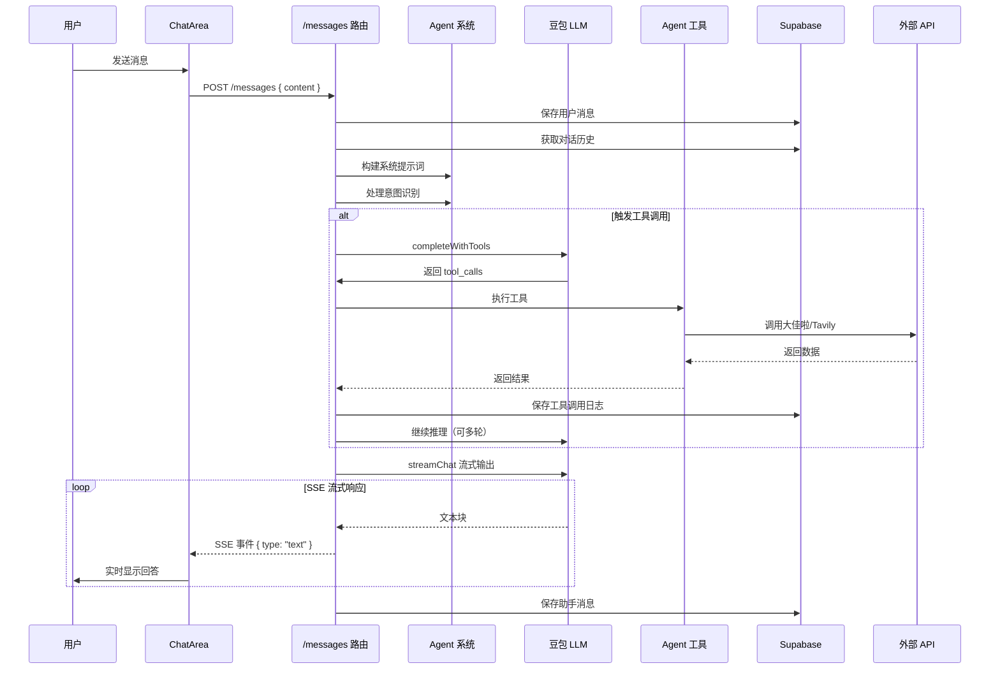
```mermaid
sequenceDiagram
    participant U as 用户
    participant UI as ChatArea
    participant API as /messages 路由
    participant AGENT as Agent 系统
    participant LLM as 豆包 LLM
    participant TOOLS as Agent 工具
    participant DB as Supabase
    participant EXT as 外部 API

    U->>UI: 发送消息
    UI->>API: POST /messages { content }
    API->>DB: 保存用户消息
    API->>DB: 获取对话历史
    API->>AGENT: 构建系统提示词
    API->>AGENT: 处理意图识别

    alt 触发工具调用
        API->>LLM: completeWithTools
        LLM->>API: 返回 tool_calls
        API->>TOOLS: 执行工具
        TOOLS->>EXT: 调用大佳啦/Tavily
        EXT-->>TOOLS: 返回数据
        TOOLS-->>API: 返回结果
        API->>DB: 保存工具调用日志
        API->>LLM: 继续推理（可多轮）
    end

    API->>LLM: streamChat 流式输出
    loop SSE 流式响应
        LLM-->>API: 文本块
        API-->>UI: SSE 事件 { type: "text" }
        UI->>U: 实时显示回答
    end

    API->>DB: 保存助手消息
```

## 三、Agent 工具系统架构

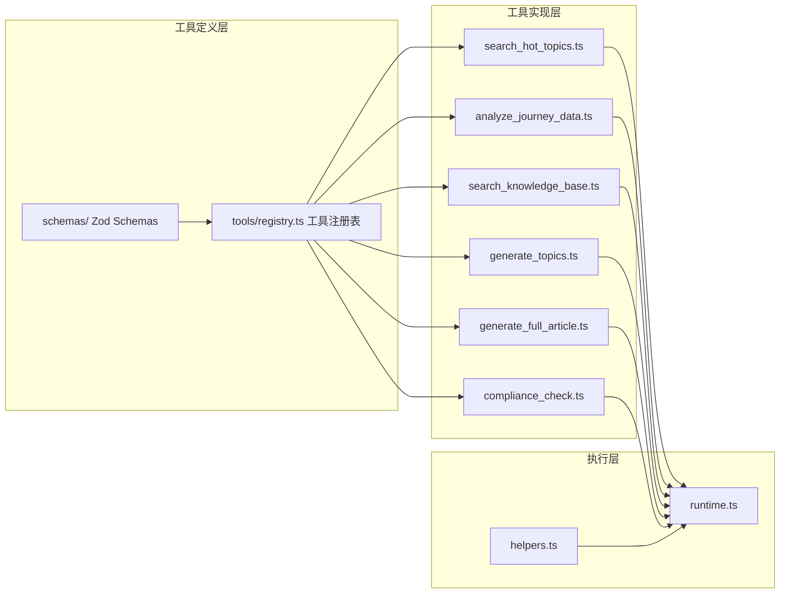
```mermaid
graph LR
    subgraph "工具定义层"
        SCHEMAS[schemas/ Zod Schemas]
        DEFINITIONS[tools/registry.ts 工具注册表]
    end

    subgraph "工具实现层"
        T1[search_hot_topics.ts]
        T2[analyze_journey_data.ts]
        T3[search_knowledge_base.ts]
        T4[generate_topics.ts]
        T5[generate_full_article.ts]
        T6[compliance_check.ts]
    end

    subgraph "执行层"
        RUNTIME[runtime.ts]
        HELPERS[helpers.ts]
    end

    SCHEMAS --> DEFINITIONS
    DEFINITIONS --> T1
    DEFINITIONS --> T2
    DEFINITIONS --> T3
    DEFINITIONS --> T4
    DEFINITIONS --> T5
    DEFINITIONS --> T6

    T1 --> RUNTIME
    T2 --> RUNTIME
    T3 --> RUNTIME
    T4 --> RUNTIME
    T5 --> RUNTIME
    T6 --> RUNTIME

    HELPERS --> RUNTIME
```

## 四、数据库 Schema 关系

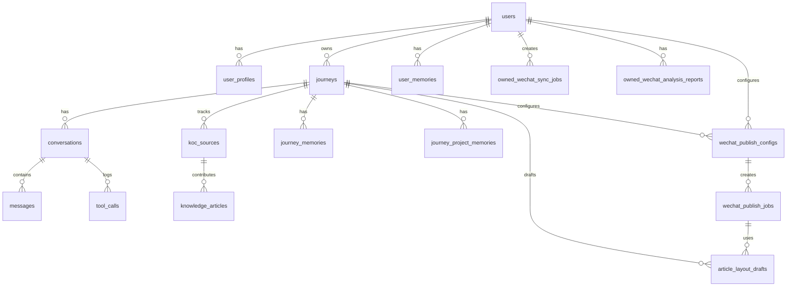
```mermaid
erDiagram
    users ||--o{ user_profiles : has
    users ||--o{ journeys : owns
    users ||--o{ user_memories : has

    journeys ||--o{ conversations : has
    journeys ||--o{ koc_sources : tracks
    journeys ||--o{ journey_memories : has
    journeys ||--o{ journey_project_memories : has
    journeys ||--o{ article_layout_drafts : drafts
    journeys ||--o{ wechat_publish_configs : configures

    conversations ||--o{ messages : contains
    conversations ||--o{ tool_calls : logs

    koc_sources ||--o{ knowledge_articles : contributes

    users ||--o{ wechat_publish_configs : configures
    wechat_publish_configs ||--o{ wechat_publish_jobs : creates
    wechat_publish_jobs ||--o{ article_layout_drafts : uses

    users ||--o{ owned_wechat_sync_jobs : creates
    users ||--o{ owned_wechat_analysis_reports : has
```

## 五、关键模块详细关系

### LLM 调用链路

```
用户消息
    │
    ▼
┌───────────────────────────────────────┐
│  app/api/conversations/[id]/messages/ │
│  - 意图识别 (resolveUserIntentChain)   │
│  - 焦点解析 (resolveSearchFocusChain)  │
│  - 自然语言跟进处理                     │
│  - 工具执行循环                         │
└───────────────────────────────────────┘
    │
    ├──────────────────────────────────┐
    │                                  │
    ▼                                  ▼
┌───────────────┐            ┌─────────────────┐
│ lib/llm.ts    │            │ lib/agent/      │
│ (统一接口)    │            │                 │
│               │            │                 │
│ - streamChat  │◄───────────┤ models.ts       │
│ - chat        │            │ - 模型工厂      │
│ - complete    │            │ - ChatOpenAI    │
└───────────────┘            └─────────────────┘
                                      │
                                      ▼
                            ┌─────────────────┐
                            │ runtime.ts      │
                            │                 │
                            │ - streamText    │
                            │ - invokeText    │
                            │ - invokeTools   │
                            └─────────────────┘
                                      │
                                      ▼
                            ┌─────────────────┐
                            │ 火山引擎 Ark    │
                            │ Chat API        │
                            │                 │
                            │ 深度思考 (可选) │
                            └─────────────────┘
```

### 知识库架构（向量 RAG 版本）

```
┌─────────────────────────────────────────────────────────────────┐
│                      RAG 知识库系统                              │
├─────────────────────────────────────────────────────────────────┤
│                                                                 │
│  ┌──────────────┐      ┌────────────────────┐                  │
│  │ koc_sources  │      │ knowledge_articles │                  │
│  │              │      │                    │                  │
│  │ - 账号名     │◄────►│ - 标题             │                  │
│  │ - ghid       │      │ - 内容             │                  │
│  │ - 粉丝数     │      │ - 阅读数           │                  │
│  │ - 头像       │      │ - source_type      │                  │
│  └──────────────┘      │ (competitor/      │                  │
│                        │  wechat_hot/       │                  │
│                        │  owned)            │                  │
│                        └────────────────────┘                  │
│                                   │                            │
│                                   │ 索引流程                    │
│                                   ▼                            │
│  ┌────────────────────────────────────────────────────────┐   │
│  │  lib/rag/llamaindex/                                    │   │
│  │                                                         │   │
│  │  documents.ts - 文档分块                                │   │
│  │  ├── SentenceSplitter (420 char / 60 overlap)          │   │
│  │  └── LlamaIndex Document 构建                           │   │
│  │                                                         │   │
│  │  ark-embeddings.ts - 向量生成                           │   │
│  │  ├── Ark Embeddings API                                 │   │
│  │  ├── Model: doubao-embedding-vision-251215              │   │
│  │  ├── Batch limit: 4                                     │   │
│  │  └── Dimensions: 1024                                   │   │
│  │                                                         │   │
│  │  ingest.ts - 索引写入                                   │   │
│  │  ├── 清理旧 chunks (按 source_id + model)              │   │
│  │  ├── 生成 embeddings (批处理)                           │   │
│  │  ├── 写入 knowledge_chunks 表                           │   │
│  │  └── content_hash 去重                                  │   │
│  └────────────────────────────────────────────────────────┘   │
│                                   │                            │
│                                   ▼                            │
│  ┌────────────────────────────────────────────────────────┐   │
│  │  knowledge_chunks 表                                   │   │
│  │                                                         │   │
│  │  - source_type: competitor/wechat_hot/owned            │   │
│  │  - source_table: knowledge_articles/owned_articles      │   │
│  │  - chunk_index: 分块序号                                │   │
│  │  - chunk_text: 分块文本                                 │   │
│  │  - embedding: vector(1024) Ark 向量                     │   │
│  │  - embedding_model: doubao-embedding-vision-251215     │   │
│  │  - content_hash: SHA256 内容哈希                       │   │
│  │  - read_count: 文章阅读数（用于排序）                   │   │
│  └────────────────────────────────────────────────────────┘   │
│                                   │                            │
│                                   │ 检索流程                    │
│                                   ▼                            │
│  ┌────────────────────────────────────────────────────────┐   │
│  │  lib/knowledge-base.ts (混合检索)                       │   │
│  │                                                         │   │
│  │  1. 关键词检索                                           │   │
│  │     ├── 标题/摘要/内容 LIKE 匹配                         │   │
│  │     └── 按阅读数倒序排序                                │   │
│  │                                                         │   │
│  │  2. 账号过滤                                             │   │
│  │     └── 按指定账号名称过滤结果                           │   │
│  │                                                         │   │
│  │  3. 语义召回 (当关键词结果不足时)                         │   │
│  │     └── retrieve.ts                                      │   │
│  │         ├── embedQuery 生成查询向量                      │   │
│  │         ├── pgvector 余弦相似度搜索                      │   │
│  │         ├── match_knowledge_chunks RPC                  │   │
│  │         └── minSimilarity: 0.25 过滤阈值                │   │
│  │                                                         │   │
│  │  4. 结果合并 & 重排                                      │   │
│  │     ├── 去重 (按 source_id)                             │   │
│  │     ├── 按阅读数倒序排序                                │   │
│  │     └── 生成 excerpt 摘要                               │   │
│  └────────────────────────────────────────────────────────┘   │
│                                                                 │
│  数据源：                                                       │
│  • 大佳啦 API → knowledge_articles → 知识库索引               │
│  • TikHub API → 补充数据                                       │
│  • 自有账号同步 → owned_wechat_articles → 知识库索引          │
│                                                                 │
└─────────────────────────────────────────────────────────────────┘
```

### 向量检索调用链路

```
用户查询
    │
    ▼
┌─────────────────────────────────────┐
│  lib/knowledge-base.ts              │
│  searchJourneyKnowledge()            │
└─────────────────────────────────────┘
    │
    ├─────────────────────────────────┐
    │                                  │
    ▼                                  ▼
┌──────────────────┐          ┌────────────────────────┐
│ 关键词检索        │          │ 账号过滤              │
│ (LIKE 查询)       │          │ (koc_sources 表)      │
└──────────────────┘          └────────────────────────┘
    │                                  │
    └────────────────┬─────────────────┘
                     │
                     ▼
              结果数量 < limit？
                     │
          ┌──────────┴──────────┐
          │ 是                  │ 否
          ▼                     │
  ┌────────────────────┐        │
  │ 语义召回            │        │
  │ (retrieve.ts)       │        │
  └────────────────────┘        │
          │                     │
          ▼                     │
  ┌────────────────────┐        │
  │ Ark Embeddings API │        │
  │ embedQuery()       │        │
  └────────────────────┘        │
          │                     │
          ▼                     │
  ┌────────────────────┐        │
  │ pgvector 搜索       │        │
  │ match_knowledge_   │        │
  │ chunks RPC         │        │
  └────────────────────┘        │
          │                     │
          └──────────┬──────────┘
                     ▼
          ┌────────────────────┐
          │ 结果合并 & 去重     │
          │ 按阅读数重排        │
          │ 生成 excerpt        │
          └────────────────────┘
```
## 六、技术栈清单

### 前端
| 技术 | 版本 | 用途 |
|------|------|------|
| Next.js | 16.2.4 | App Router 框架 |
| React | 19.2.4 | UI 库 |
| TypeScript | 5.x | 类型系统 |
| Ant Design | 6.3.6 | UI 组件库 |
| Ant Design X | 2.5.0 | 聊天组件 |
| Tailwind CSS | 4.x | 样式系统 |
| Day.js | 1.11.20 | 日期处理 |
| Sonner | 2.0.7 | Toast 通知 |

### 后端
| 技术 | 版本 | 用途 |
|------|------|------|
| Node.js | - | 运行时 |
| LangChain | 1.3.4 | Agent 框架 |
| LangGraph | 1.2.9 | 工作流编排 |
| OpenAI SDK | - | API 客户端 |
| Zod | 4.3.6 | Schema 验证 |

### 数据与基础设施
| 技术 | 用途 |
|------|------|
| Supabase PostgreSQL | 主数据库 |
| pgvector | 向量搜索 |
| 火山引擎 Ark | LLM API |
| 大佳啦 API | 微信公众号数据 |
| TikHub API | 微信数据补充 |
| Tavily API | 网络搜索 |
| LangSmith | 可观测性 |

### 微信生态
| 组件 | 说明 |
|------|------|
| wechat-publish.ts | 微信草稿箱发布 |
| wechat-owned-analysis.ts | 自有公众号分析 |
| article-layout.ts | Markdown → 微信 HTML |
| wechat-gateway/ | 可选的微信 API 代理 |

## 七、AI 模型与 API 汇总

### LLM 模型

| 模型 | 用途 | 提供方 | 特性 |
|------|------|--------|------|
| **Ark Chat Model** | 主对话、文章生成、选题生成 | 火山引擎 | 流式输出、深度思考支持 |
| **doubao-embedding-vision-251215** | 文本向量化 | 火山引擎 | 1024维向量、批处理 |

### Embedding 模型

| 参数 | 配置 |
|------|------|
| 模型名称 | `doubao-embedding-vision-251215` |
| 向量维度 | 1024 |
| 批处理限制 | 4 |
| API | Ark Embeddings API |

### 外部 API 集成

| API | 用途 | 用途 |
|------|------|------|
| **大佳啦 API** | 微信公众号数据 | KOC 导入、文章同步 |
| **TikHub API** | 微信数据补充 | 补充 KOC 数据 |
| **Tavily API** | 网络热点搜索 | 热点追踪、话题搜索 |
| **微信 API** | 公众号发布与数据 | 草稿箱发布、DataCube 数据 |

### 支持平台

| 平台 | 状态 | 用途 |
|------|------|------|
| **微信公众号** | ✅ 已支持 | 长文创作、排版、发布 |
| **微信视频号** | ✅ 已支持 | 短视频对标、脚本创作 |
| **小红书** | 🚧 规划中 | 笔记创作、排版 |

## 八、AI 工作流程

### AI 对话完整流程

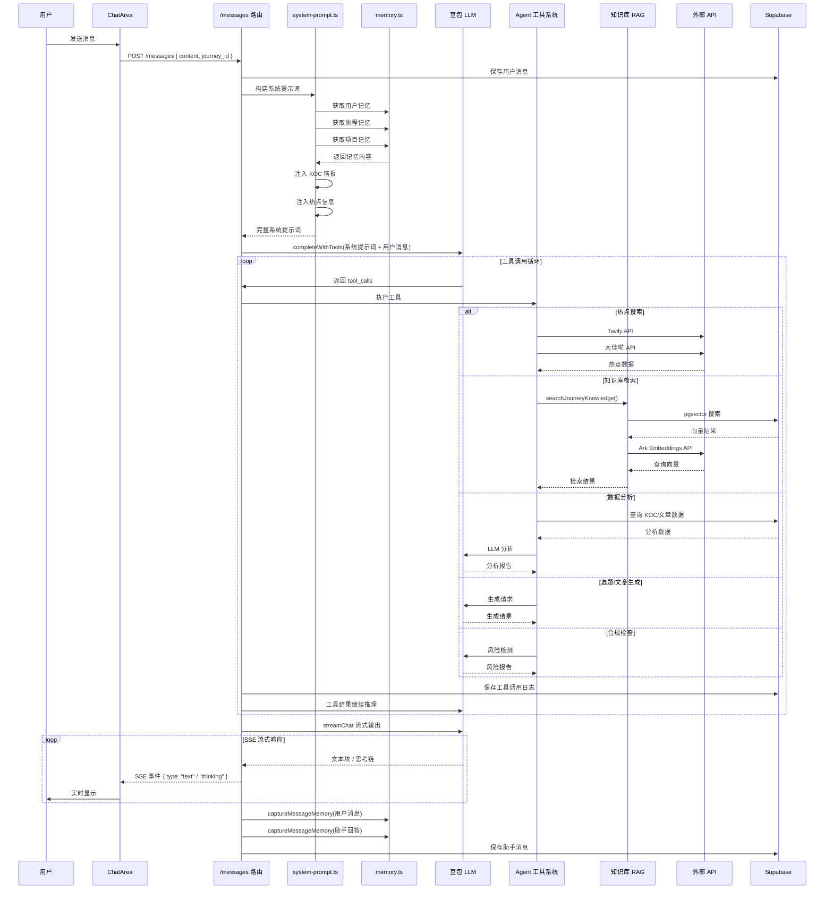
```mermaid
sequenceDiagram
    participant U as 用户
    participant UI as ChatArea
    participant API as /messages 路由
    participant SYS as system-prompt.ts
    participant MEM as memory.ts
    participant LLM as 豆包 LLM
    participant AGENT as Agent 工具系统
    participant KB as 知识库 RAG
    participant EXT as 外部 API
    participant DB as Supabase

    U->>UI: 发送消息
    UI->>API: POST /messages { content, journey_id }
    API->>DB: 保存用户消息

    API->>SYS: 构建系统提示词
    SYS->>MEM: 获取用户记忆
    SYS->>MEM: 获取旅程记忆
    SYS->>MEM: 获取项目记忆
    MEM-->>SYS: 返回记忆内容
    SYS->>SYS: 注入 KOC 情报
    SYS->>SYS: 注入热点信息
    SYS-->>API: 完整系统提示词

    API->>LLM: completeWithTools(系统提示词 + 用户消息)

    loop 工具调用循环
        LLM->>API: 返回 tool_calls
        API->>AGENT: 执行工具

        alt 热点搜索
            AGENT->>EXT: Tavily API
            AGENT->>EXT: 大佳啦 API
            EXT-->>AGENT: 热点数据
        else 知识库检索
            AGENT->>KB: searchJourneyKnowledge()
            KB->>DB: pgvector 搜索
            DB-->>KB: 向量结果
            KB->>EXT: Ark Embeddings API
            EXT-->>KB: 查询向量
            KB-->>AGENT: 检索结果
        else 数据分析
            AGENT->>DB: 查询 KOC/文章数据
            DB-->>AGENT: 分析数据
            AGENT->>LLM: LLM 分析
            LLM-->>AGENT: 分析报告
        else 选题/文章生成
            AGENT->>LLM: 生成请求
            LLM-->>AGENT: 生成结果
        else 合规检查
            AGENT->>LLM: 风险检测
            LLM-->>AGENT: 风险报告
        end

        API->>DB: 保存工具调用日志
        API->>LLM: 工具结果继续推理
    end

    API->>LLM: streamChat 流式输出

    loop SSE 流式响应
        LLM-->>API: 文本块 / 思考链
        API-->>UI: SSE 事件 { type: "text" / "thinking" }
        UI->>U: 实时显示
    end

    API->>MEM: captureMessageMemory(用户消息)
    API->>MEM: captureMessageMemory(助手回答)
    API->>DB: 保存助手消息
```

### Agent 工具调用决策流程

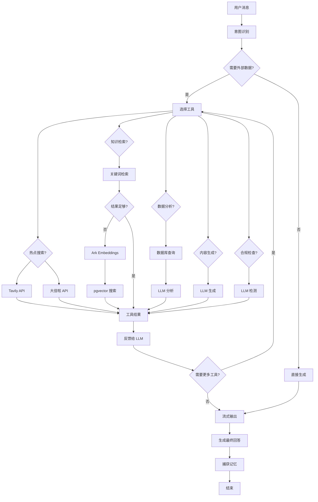
```mermaid
graph TB
    START[用户消息] --> INTENT[意图识别]
    INTENT --> NEED{需要外部数据?}

    NEED -->|是| TOOLS[选择工具]
    NEED -->|否| DIRECT[直接生成]

    TOOLS --> HOT{热点搜索?}
    TOOLS --> KB{知识检索?}
    TOOLS --> DATA{数据分析?}
    TOOLS --> GEN{内容生成?}
    TOOLS --> COMP{合规检查?}

    HOT --> TAV[Tavily API]
    HOT --> DJL[大佳啦 API]
    TAV --> RESULT[工具结果]
    DJL --> RESULT

    KB --> KEY[关键词检索]
    KEY --> VEC{结果足够?}
    VEC -->|否| EMB[Ark Embeddings]
    EMB --> PGV[pgvector 搜索]
    PGV --> RESULT
    VEC -->|是| RESULT

    DATA --> QUERY[数据库查询]
    QUERY --> LLM2[LLM 分析]
    LLM2 --> RESULT

    GEN --> LLM3[LLM 生成]
    LLM3 --> RESULT

    COMP --> LLM4[LLM 检测]
    LLM4 --> RESULT

    RESULT --> FEEDBACK[反馈给 LLM]
    FEEDBACK --> MORE{需要更多工具?}
    MORE -->|是| TOOLS
    MORE -->|否| STREAM[流式输出]

    DIRECT --> STREAM
    STREAM --> FINAL[生成最终回答]
    FINAL --> MEM[捕获记忆]
    MEM --> END[结束]
```

### RAG 知识库 AI 工作流

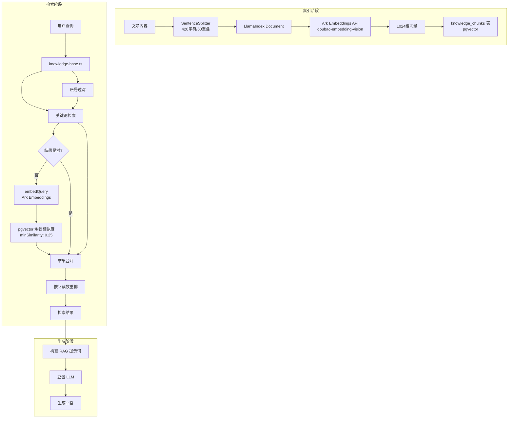
```mermaid
graph TB
    subgraph "索引阶段"
        ART[文章内容] --> SPLIT[SentenceSplitter<br/>420字符/60重叠]
        SPLIT --> DOC[LlamaIndex Document]
        DOC --> EMB[Ark Embeddings API<br/>doubao-embedding-vision]
        EMB --> VEC[1024维向量]
        VEC --> CHUNKS[knowledge_chunks 表<br/>pgvector]
    end

    subgraph "检索阶段"
        QUERY[用户查询] --> KB[knowledge-base.ts]
        KB --> KW[关键词检索]
        KB --> ACC[账号过滤]
        KW --> NOT_ENOUGH{结果足够?}
        ACC --> KW
        NOT_ENOUGH -->|否| QVEC[embedQuery<br/>Ark Embeddings]
        QVEC --> PGV[pgvector 余弦相似度<br/>minSimilarity: 0.25]
        PGV --> MERGE[结果合并]
        NOT_ENOUGH -->|是| MERGE
        KW --> MERGE
        MERGE --> RANK[按阅读数重排]
        RANK --> RES[检索结果]
    end

    subgraph "生成阶段"
        RES --> PROMPT[构建 RAG 提示词]
        PROMPT --> LLM[豆包 LLM]
        LLM --> ANSWER[生成回答]
    end
```

### 记忆系统 AI 工作流

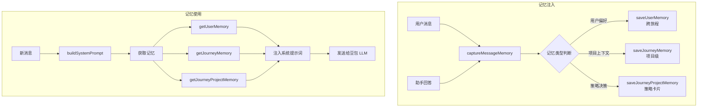
```mermaid
graph TB
    subgraph "记忆注入"
        USER_MSG[用户消息] --> CAPTURE[captureMessageMemory]
        ASSIST_MSG[助手回答] --> CAPTURE
        CAPTURE --> CLASSIFY{记忆类型判断}

        CLASSIFY -->|用户偏好| USER_MEM[saveUserMemory<br/>跨旅程]
        CLASSIFY -->|项目上下文| JOURNEY_MEM[saveJourneyMemory<br/>项目级]
        CLASSIFY -->|策略决策| PROJ_MEM[saveJourneyProjectMemory<br/>策略卡片]
    end

    subgraph "记忆使用"
        NEW_MSG[新消息] --> SYS[buildSystemPrompt]
        SYS --> FETCH[获取记忆]
        FETCH --> UM[getUserMemory]
        FETCH --> JM[getJourneyMemory]
        FETCH --> PM[getJourneyProjectMemory]
        UM --> INJECT[注入系统提示词]
        JM --> INJECT
        PM --> INJECT
        INJECT --> LLM[发送给豆包 LLM]
    end
```

## 十、产品功能架构

### 核心用户旅程

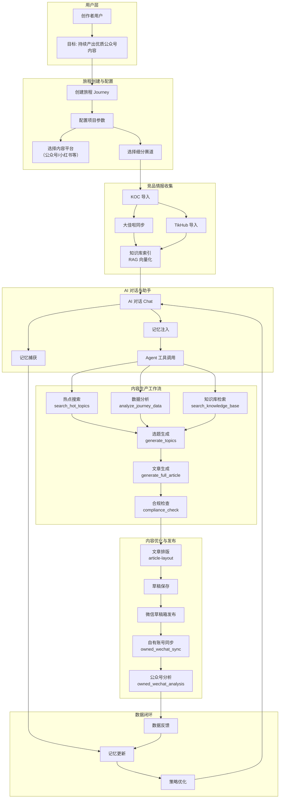
```mermaid
graph TB
    subgraph "用户层"
        USER[创作者用户]
        GOAL["目标: 持续产出优质公众号内容"]
    end

    subgraph "旅程创建与配置"
        J_CREATE["创建旅程 Journey"]
        J_CONFIG["配置项目参数"]
        C_PLATFORM["选择内容平台<br/>（公众号/小红书等）"]
        C_TRACK["选择细分赛道"]
    end

    subgraph "竞品情报收集"
        KOC_IMPORT["KOC 导入"]
        DJL_SYNC["大佳啦同步"]
        KH_IMPORT["TikHub 导入"]
        KB_INDEX["知识库索引<br/>RAG 向量化"]
    end

    subgraph "AI 对话与助手"
        CHAT["AI 对话 Chat"]
        MEM_INJECT["记忆注入"]
        MEM_CAPTURE["记忆捕获"]
        TOOL_CALL["Agent 工具调用"]
    end

    subgraph "内容生产工作流"
        HOT_SEARCH["热点搜索<br/>search_hot_topics"]
        DATA_ANALYSIS["数据分析<br/>analyze_journey_data"]
        KB_SEARCH["知识库检索<br/>search_knowledge_base"]
        TOPIC_GEN["选题生成<br/>generate_topics"]
        ARTICLE_GEN["文章生成<br/>generate_full_article"]
        COMP_CHECK["合规检查<br/>compliance_check"]
    end

    subgraph "内容优化与发布"
        LAYOUT["文章排版<br/>article-layout"]
        DRAFT_SAVE["草稿保存"]
        WC_PUBLISH["微信草稿箱发布"]
        DATA_SYNC["自有账号同步<br/>owned_wechat_sync"]
        ANALYSIS["公众号分析<br/>owned_wechat_analysis"]
    end

    subgraph "数据闭环"
        FEEDBACK["数据反馈"]
        MEM_UPDATE["记忆更新"]
        IMPROVE["策略优化"]
    end

    USER --> GOAL
    GOAL --> J_CREATE
    J_CREATE --> J_CONFIG
    J_CONFIG --> C_PLATFORM
    J_CONFIG --> C_TRACK
    C_TRACK --> KOC_IMPORT

    KOC_IMPORT --> DJL_SYNC
    KOC_IMPORT --> KH_IMPORT
    DJL_SYNC --> KB_INDEX
    KH_IMPORT --> KB_INDEX

    KB_INDEX --> CHAT

    CHAT --> MEM_INJECT
    MEM_INJECT --> TOOL_CALL
    TOOL_CALL --> HOT_SEARCH
    TOOL_CALL --> DATA_ANALYSIS
    TOOL_CALL --> KB_SEARCH

    HOT_SEARCH --> TOPIC_GEN
    DATA_ANALYSIS --> TOPIC_GEN
    KB_SEARCH --> TOPIC_GEN

    TOPIC_GEN --> ARTICLE_GEN
    ARTICLE_GEN --> COMP_CHECK
    COMP_CHECK --> LAYOUT

    LAYOUT --> DRAFT_SAVE
    DRAFT_SAVE --> WC_PUBLISH
    WC_PUBLISH --> DATA_SYNC
    DATA_SYNC --> ANALYSIS

    ANALYSIS --> FEEDBACK
    CHAT --> MEM_CAPTURE
    MEM_CAPTURE --> MEM_UPDATE
    FEEDBACK --> MEM_UPDATE
    MEM_UPDATE --> IMPROVE
    IMPROVE --> CHAT
```

### 功能模块详细图

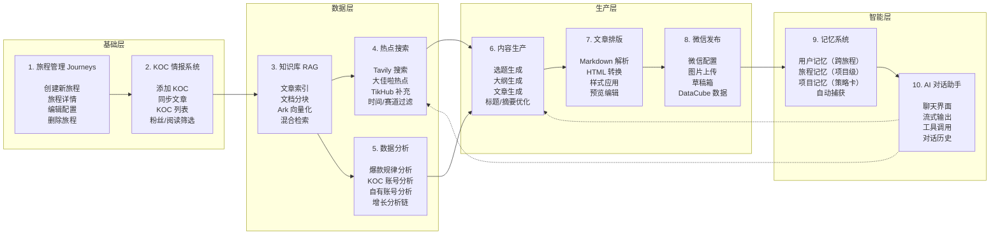
```mermaid
graph LR
    subgraph "基础层"
        G1["1. 旅程管理 Journeys<br/><br/>创建新旅程<br/>旅程详情<br/>编辑配置<br/>删除旅程"]
        G2["2. KOC 情报系统<br/><br/>添加 KOC<br/>同步文章<br/>KOC 列表<br/>粉丝/阅读筛选"]
    end

    subgraph "数据层"
        G3["3. 知识库 RAG<br/><br/>文章索引<br/>文档分块<br/>Ark 向量化<br/>混合检索"]
        G4["4. 热点搜索<br/><br/>Tavily 搜索<br/>大佳啦热点<br/>TikHub 补充<br/>时间/赛道过滤"]
        G5["5. 数据分析<br/><br/>爆款规律分析<br/>KOC 账号分析<br/>自有账号分析<br/>增长分析链"]
    end

    subgraph "生产层"
        G6["6. 内容生产<br/><br/>选题生成<br/>大纲生成<br/>文章生成<br/>标题/摘要优化"]
        G7["7. 文章排版<br/><br/>Markdown 解析<br/>HTML 转换<br/>样式应用<br/>预览编辑"]
        G8["8. 微信发布<br/><br/>微信配置<br/>图片上传<br/>草稿箱<br/>DataCube 数据"]
    end

    subgraph "智能层"
        G9["9. 记忆系统<br/><br/>用户记忆（跨旅程）<br/>旅程记忆（项目级）<br/>项目记忆（策略卡）<br/>自动捕获"]
        G10["10. AI 对话助手<br/><br/>聊天界面<br/>流式输出<br/>工具调用<br/>对话历史"]
    end

    G1 --> G2
    G2 --> G3
    G3 --> G4
    G3 --> G5
    G4 --> G6
    G5 --> G6
    G6 --> G7
    G7 --> G8
    G8 --> G9
    G9 --> G10
    G10 -.-> G4
    G10 -.-> G6
```
    HOT_SEARCH --> HOT_DJL
    HOT_SEARCH --> HOT_KH

    HOT_SEARCH --> ANALYSIS_VIRAL
    KB_SEARCH --> ANALYSIS_KOC
    KOC_SYNC --> ANALYSIS_KOC
    ANALYSIS_KOC --> ANALYSIS_OWN
    ANALYSIS_OWN --> ANALYSIS_GROWTH

    ANALYSIS_VIRAL --> PROD_TOPIC
    ANALYSIS_KOC --> PROD_TOPIC
    KB_SEARCH --> PROD_TOPIC

    PROD_TOPIC --> PROD_OUTLINE
    PROD_OUTLINE --> PROD_ARTICLE
    PROD_ARTICLE --> PROD_TITLE
    PROD_ARTICLE --> PROD_SUMMARY

    PROD_ARTICLE --> LAYOUT_MD
    LAYOUT_MD --> LAYOUT_HTML
    LAYOUT_HTML --> LAYOUT_STYLES
    LAYOUT_STYLES --> LAYOUT_PREVIEW

    LAYOUT_PREVIEW --> WC_CONFIG
    WC_CONFIG --> WC_UPLOAD
    WC_UPLOAD --> WC_DRAFT
    WC_DRAFT --> WC_PUB
    WC_PUB --> WC_CUBE

    CHAT_UI --> MEM_CAPTURE
    MEM_CAPTURE --> MEM_USER
    MEM_CAPTURE --> MEM_JOURNEY
    MEM_CAPTURE --> MEM_PROJECT
    MEM_USER --> CHAT_UI
    MEM_JOURNEY --> CHAT_UI
    MEM_PROJECT --> CHAT_UI
```

### Agent 工具完整流程

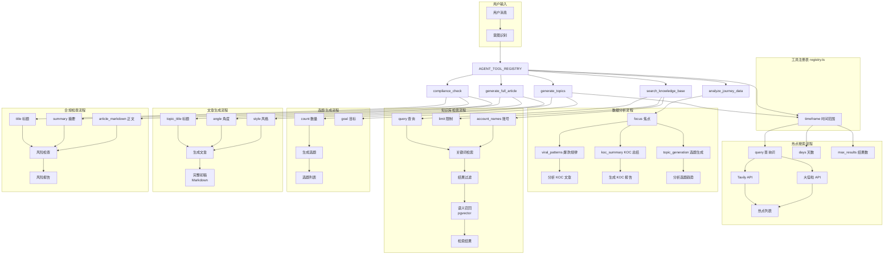
```mermaid
graph TB
    subgraph "用户输入"
        INPUT["用户消息"]
        INTENT["意图识别"]
    end

    subgraph "工具注册表 registry.ts"
        REGISTRY["AGENT_TOOL_REGISTRY"]
        T1["search_hot_topics"]
        T2["analyze_journey_data"]
        T3["search_knowledge_base"]
        T4["generate_topics"]
        T5["generate_full_article"]
        T6["compliance_check"]
    end

    subgraph "热点搜索流程"
        T1 --> Q1["query 查询词"]
        T1 --> D1["days 天数"]
        T1 --> R1["max_results 结果数"]
        Q1 --> TV1["Tavily API"]
        Q1 --> DJ1["大佳啦 API"]
        TV1 --> RES1["热点列表"]
        DJ1 --> RES1
    end

    subgraph "数据分析流程"
        T2 --> FOCUS["focus 焦点"]
        FOCUS --> F1["viral_patterns 爆款规律"]
        FOCUS --> F2["koc_summary KOC 总结"]
        FOCUS --> F3["topic_generation 选题生成"]
        F1 --> AN1["分析 KOC 文章"]
        F2 --> AN2["生成 KOC 报告"]
        F3 --> AN3["分析选题趋势"]
    end

    subgraph "知识库检索流程"
        T3 --> Q2["query 查询"]
        T3 --> L1["limit 限制"]
        T3 --> ACC["account_names 账号"]
        Q2 --> KW["关键词检索"]
        ACC --> KW
        KW --> FIL1["结果过滤"]
        FIL1 --> VEC["语义召回<br/>pgvector"]
        VEC --> RES2["检索结果"]
    end

    subgraph "选题生成流程"
        T4 --> C1["count 数量"]
        T4 --> G1["goal 目标"]
        T4 --> T1["timeframe 时间范围"]
        C1 --> GENT["生成选题"]
        GENT --> TOP["选题列表"]
    end

    subgraph "文章生成流程"
        T5 --> TT["topic_title 标题"]
        T5 --> ANG["angle 角度"]
        T5 --> STY["style 风格"]
        TT --> GENA["生成文章"]
        ANG --> GENA
        STY --> GENA
        GENA --> ART["完整初稿<br/>Markdown"]
    end

    subgraph "合规检查流程"
        T6 --> TI["title 标题"]
        T6 --> SU["summary 摘要"]
        T6 --> AM["article_markdown 正文"]
        TI --> CHECK["风险检查"]
        SU --> CHECK
        AM --> CHECK
        CHECK --> RISK["风险报告"]
    end

    INPUT --> INTENT
    INTENT --> REGISTRY
    REGISTRY --> T1
    REGISTRY --> T2
    REGISTRY --> T3
    REGISTRY --> T4
    REGISTRY --> T5
    REGISTRY --> T6
```

### 数据流转全景图

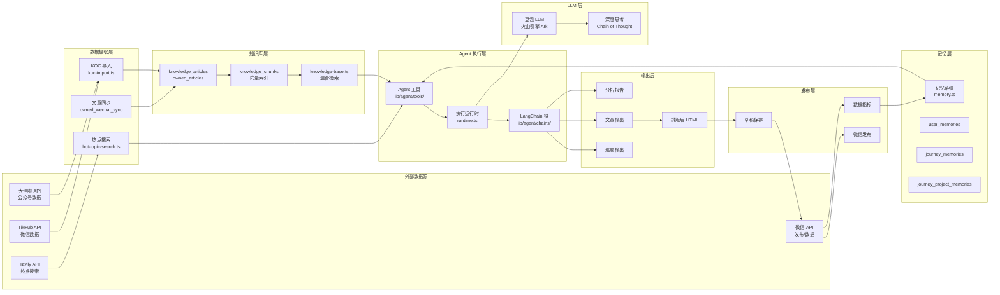
```mermaid
graph LR
    subgraph "外部数据源"
        DJL["大佳啦 API<br/>公众号数据"]
        KH["TikHub API<br/>微信数据"]
        TV["Tavily API<br/>热点搜索"]
        WC["微信 API<br/>发布/数据"]
    end

    subgraph "数据摄取层"
        IMPORT["KOC 导入<br/>koc-import.ts"]
        SYNC["文章同步<br/>owned_wechat_sync"]
        SEARCH["热点搜索<br/>hot-topic-search.ts"]
    end

    subgraph "知识库层"
        ARTICLES["knowledge_articles<br/>owned_articles"]
        CHUNKS["knowledge_chunks<br/>向量索引"]
        KB["knowledge-base.ts<br/>混合检索"]
    end

    subgraph "记忆层"
        MEM["记忆系统<br/>memory.ts"]
        UM["user_memories"]
        JM["journey_memories"]
        PM["journey_project_memories"]
    end

    subgraph "Agent 执行层"
        TOOLS["Agent 工具<br/>lib/agent/tools/"]
        RUNTIME["执行运行时<br/>runtime.ts"]
        CHAINS["LangChain 链<br/>lib/agent/chains/"]
    end

    subgraph "LLM 层"
        MODEL["豆包 LLM<br/>火山引擎 Ark"]
        DEEP["深度思考<br/>Chain of Thought"]
    end

    subgraph "输出层"
        TOPICS["选题输出"]
        ARTICLES_OUT["文章输出"]
        ANALYSIS["分析报告"]
        LAYOUT["排版后 HTML"]
    end

    subgraph "发布层"
        DRAFT["草稿保存"]
        PUBLISH["微信发布"]
        METRICS["数据指标"]
    end

    DJL --> IMPORT
    KH --> IMPORT
    TV --> SEARCH

    IMPORT --> ARTICLES
    SYNC --> ARTICLES
    ARTICLES --> CHUNKS
    CHUNKS --> KB

    KB --> TOOLS
    SEARCH --> TOOLS
    MEM --> TOOLS

    TOOLS --> RUNTIME
    RUNTIME --> CHAINS
    RUNTIME --> MODEL
    MODEL --> DEEP

    CHAINS --> TOPICS
    CHAINS --> ARTICLES_OUT
    CHAINS --> ANALYSIS

    ARTICLES_OUT --> LAYOUT
    LAYOUT --> DRAFT
    DRAFT --> WC
    WC --> PUBLISH
    WC --> METRICS
    METRICS --> MEM
```

## 十二、核心设计模式

### 1. Server Components 优先
```
页面: Server Component
  ├─ 加载初始数据
  └─ 客户端交互组件 (Client Component)
```

### 2. SSE 流式响应
```
API → ReadableStream → SSE Events → UI 实时更新
```

### 3. Agent 工具模式
```
Schema → Definition → Execution → Result
```

### 4. 记忆系统
```
用户记忆 + 旅程记忆 + 项目记忆 → 动态注入系统提示词
```

### 5. RLS 行级安全

```text
Supabase RLS → 用户数据隔离
```

## 十三、落地可行性

### 技术实现路径

#### 核心技术成熟度

| 模块 | 技术成熟度 | 风险等级 | 说明 |
|------|------------|----------|------|
| **LLM 调用** | ✅ 成熟 | 低 | 火山引擎 Ark API 稳定，已实现流式输出 |
| **Agent 工具系统** | ✅ 成熟 | 低 | LangChain 1.3.4 + 工具注册表已实现 |
| **RAG 知识库** | ✅ 成熟 | 低 | pgvector + Ark Embeddings 已部署 |
| **记忆系统** | ✅ 成熟 | 低 | 三层记忆架构已实现 |
| **KOC 导入** | ✅ 成熟 | 中 | 大佳啦/TikHub API 依赖第三方 |
| **微信发布** | ✅ 成熟 | 中 | 微信 API 依赖外部服务 |
| **多平台扩展** | 🚧 部分完成 | 中 | 公众号/视频号已完成，小红书待开发 |

#### 技术依赖风险

```
高风险依赖
├── 大佳啦 API (KOC 数据源)
│   └── 缓解: TikHub 备用 + 数据缓存
├── 火山引擎 Ark (LLM)
│   └── 缓解: OpenAI/通义千问 可替换接口
├── 微信 API (发布渠道)
│   └── 缓解: 草稿箱 + DataCube 数据
└── Tavily API (热点搜索)
    └── 缓解: 大佳啦热点 + 自建搜索索引

低风险依赖
├── Supabase (数据库 + RLS)
├── Next.js (前端框架)
└── LangChain (Agent 框架)
```

### 开发节奏

#### MVP 阶段 (已实现)

```
Week 1-4: 基础架构
├── Next.js 16 + App Router 搭建
├── Supabase 数据库设计与 RLS
├── 用户认证系统
└── 基础 UI 框架 (Ant Design)

Week 5-8: AI 核心能力
├── 豆包 LLM 客户端集成
├── LangChain Agent 工具系统
├── 6 个核心工具实现
└── SSE 流式对话

Week 9-12: 知识库与记忆
├── RAG 向量检索系统
├── 三层记忆系统
├── KOC 导入与大佳啦集成
└── 微信草稿箱发布
```

#### 优化阶段 (进行中)

```
Week 13-16: 产品完善
├── 文章排版引擎优化
├── 自有公众号数据分析
├── 视频号 KOC 导入
└── UI/UX 优化

Week 17-20: 增强功能
├── 深度思考优化
├── LangSmith 可观测性
├── 合规检查强化
└── 数据闭环完善
```

#### 扩展阶段 (规划中)

```
Week 21-24: 多平台支持
├── 小红书内容创作
├── 抖音/快手对标
├── 跨平台统一赛道树
└── 多格式排版适配

Week 25+: 企业功能
├── 团队协作增强
├── 企业版 API 开放
├── 私有化部署支持
└── 定制化服务
```

### 所需资源评估

#### 人力资源

```
核心团队配置 (最小可用)

角色                人数   主要职责
─────────────────────────────────────────────────────
全栈开发工程师       1-2    Next.js + Supabase + AI 集成
AI 工程师          1       LangChain Agent + Prompt 优化
产品经理            1       需求定义 + 用户研究
UI/UX 设计师       0.5     设计系统 + 交互优化
运维/DevOps        0.5     部署 + 监控 + 成本优化
─────────────────────────────────────────────────────
合计                4-5 人
```

#### 技术基础设施

```
云服务资源 (按 1000 用户估算)

资源项                 月成本    说明
────────────────────────────────────────────────────
Supabase Pro          $25      数据库 + RLS + pgvector
火山引擎 Ark           $50      LLM + Embedding (按量)
Next.js 部署 (Vercel) $20      前端托管
API 调用              $30      大佳啦 + Tavily + TikHub
监控与日志            $10      LangSmith + 日志服务
────────────────────────────────────────────────────
合计                  ~$135/月
```

#### API 费用估算

```
火山引擎 Ark (按量)
├── LLM: ~0.02元/千tokens
│   └── 单用户日均 10万 tokens → ~2元/天
├── Embeddings: ~0.007元/千tokens
│   └── 单用户日均 5万 tokens → ~0.35元/天
└── 1000 用户月成本: ~7000元

第三方 API
├── 大佳啦: ~500元/月 (基础套餐)
├── Tavily: $100/月 (Pro 套餐)
├── TikHub: ~200元/月 (按量)
└── 合计: ~1000元/月
```

### 技术债务与风险

| 风险类型 | 影响 | 缓解措施 |
|-----------|------|----------|
| **第三方 API 依赖** | 高 | 多数据源备份 + 缓存策略 |
| **LLM 成本不可控** | 中 | Token 优化 + 模型分级 + 按量计费 |
| **微信 API 限制** | 中 | 草稿箱优先 + 用户自操作 |
| **向量搜索性能** | 低 | pgvector 优化 + 索引策略 |
| **数据合规** | 高 | AIGC 标识 + RLS + 审核流程 |

---

## 十四、商业化思考

### 盈利模式

#### 1. 订阅制 (SaaS 模式)

```
个人创作者
├── 免费版
│   ├── 每月 10 次 AI 对话
│   ├── 单个旅程
│   ├── 3 个 KOC 追踪
│   └── 基础知识库
├── 专业版 ¥99/月
│   ├── 无限 AI 对话
│   ├── 5 个旅程
│   ├── 20 个 KOC 追踪
│   ├── 完整知识库 + 向量检索
│   ├── 文章排版与发布
│   └── 优先客服支持
└── 终身版 ¥999/次
    └── 所有专业版功能

小微团队 / MCN
├── 团队版 ¥499/月
│   ├── 5 个账号
│   ├── 20 个旅程
│   ├── 100 个 KOC 追踪
│   ├── 团队协作 (权限管理)
│   ├── 批量内容生成
│   ├── 多平台统一管理
│   └── API 访问权限
└── 企业版 ¥1999/月
    ├── 无限账号
    ├── 私有化部署
    ├── 定制化开发
    └── 专属客户经理
```

#### 2. 按量付费

```
API 调用计费
├── LLM Token: 0.05元/千tokens (批发价)
├── 向量检索: 0.01元/次
├── 文章生成: 5元/篇 (高配模型)
└── 数据分析: 10元/份报告

超额资源
├── 对话次数: ¥1/次
├── KOC 追踪: ¥5/个/月
└── 向量存储: ¥0.1/千条/月
```

#### 3. 增值服务

```
高级功能
├── 专属模型微调: ¥5000 起
├── 行业知识库定制: ¥2000 起
├── 数据分析报告: ¥500/份
├── 运营策略咨询: ¥2000/小时
└── 1v1 辅导: ¥500/次

API 服务
├── 企业版 API: ¥9999/月
├── 白标服务: ¥19999/年
└── 私有化部署: ¥50000 起
```

### 目标市场

#### 市场分层

```
第一梯队: 个人创作者 (30%)
├── 自媒体博主
├── 自由撰稿人
├── 副业创作者
└── 市场规模: 100万+ 用户
    ├── 单价: ¥99/月
    └── 年营收潜力: 3600万

第二梯队: 小微团队 (40%)
├── 新媒体工作室 (3-10人)
├── MCN 机构
├── 企业新媒体部
└── 市场规模: 20万+ 客户
    ├── 单价: ¥499-1999/月
    └── 年营收潜力: 6000万

第三梯队: 大型企业 (30%)
├── 品牌营销部
├── 电商内容团队
├── 政府/教育机构
└── 市场规模: 5000+ 客户
    ├── 单价: ¥20000+/月
    └── 年营收潜力: 1200万
```

#### 细分赛道机会

| 赛道 | 痛点 | Niche 价值 | 获客难度 |
|------|------|------------|----------|
| **职场成长** | 需持续输出，选题枯竭 | KOC 情报 + 热点追踪 | 低 |
| **AI 与科技** | 技术快，需要对标 | KOC 追踪 + 规律分析 | 中 |
| **财经商业** | 合规要求高 | 合规检查 + 专业库 | 高 |
| **生活方式** | 视觉要求高 | 排版优化 + 配图建议 | 中 |
| **教育** | 内容结构化 | 大纲生成 + 知识库 | 低 |

### 竞争优势

#### vs 壹伴/135编辑器/秀米

| 维度 | 竞品 | Niche 差异化 |
|------|------|------------|
| **定位** | AI 编辑器 | 内容策略合伙人 |
| **KOC 情报** | ❌ 无 | ✅ 大佳啦导入 + 自动分析 |
| **RAG 知识库** | ❌ 无 | ✅ 向量检索 + 混合搜索 |
| **记忆系统** | ❌ 无 | ✅ 三层记忆 + 自动捕获 |
| **多平台** | 专注公众号 | ✅ 公众号 + 视频号 + 小红书 |
| **可观测性** | ❌ 无 | ✅ LangSmith 追踪 |
| **自托管** | SaaS only | ✅ 支持私有化部署 |

#### 独特护城河

```
技术护城河
├── LangChain Agent 工具编排 (竞品无)
├── pgvector + Ark Embeddings RAG (竞品无)
├── 三层记忆系统 (竞品无)
└── 旅程式项目管理体系 (首创)

数据护城河
├── KOC 情报库 (积累效应)
├── 知识库向量索引 (用户自建)
├── 行业爆款规律 (AI 持续学习)
└── 用户行为数据 (优化推荐)

网络效应
├── KOC 数据共享 (平台化)
├── 知识库模板市场 (UGC)
├── 行业赛道树 (持续扩展)
└── 社区运营 (用户留存)
```

### 市场进入策略

#### 阶段 1: 种子用户验证 (Month 1-3)

```
目标: 100 付费用户, ¥10k MRR

策略
├── 免费试用 14 天
├── 早期用户 5 折优惠
├── 社区运营 (微信群/知识星球)
├── 内容营销 (公众号/小红书)
└── KOL 合作 (科技/职场博主)
```

#### 阶段 2: 增长爬坡 (Month 4-6)

```
目标: 1000 付费用户, ¥100k MRR

策略
├── 产品功能完善 (视频号/小红书)
├── 付费推广 (投放/SEO)
├── 渠道合作 (新媒体培训机构)
├── 客户成功体系 (客服/培训)
└── 用户口碑传播 (邀请返现)
```

#### 阶段 3: 规模化 (Month 7-12)

```
目标: 5000 付费用户, ¥500k MRR

策略
├── 企业版产品
├── 私有化部署服务
├── 生态建设 (模板市场/插件)
├── 多语言支持 (出海)
└── 融资扩张
```

### 盈亏平衡分析

```
固定成本 (月)
├── 人力成本: ¥150k (5人 × ¥30k)
├── 基础设施: ¥5k (服务器/域名/工具)
└── 合计: ¥155k

可变成本 (按 5000 付费用户)
├── API 调用: ¥100k (火山引擎 + 第三方)
├── 客服支持: ¥10k (兼职)
└── 合计: ¥110k

总成本: ¥265k/月

盈亏平衡点
├── 假设 ARPU = ¥300/月 (混合个人/团队)
├── 盈亏平衡用户数 = 265k ÷ 300 ≈ 883 用户
├── 目标毛利 40%: 需 1500 付费用户
└── 目标净利润 100k/月: 需 1700 付费用户
```

### 风险与应对

| 风险 | 概率 | 影响 | 应对策略 |
|------|------|------|----------|
| **微信封禁 AI 生成内容** | 中 | 高 | AIGC 标识 + 人工审核流程 |
| **大佳啦 API 停服** | 低 | 高 | TikHub 备用 + 自建爬虫 |
| **火山引擎涨价** | 中 | 中 | 多模型备选 + 按量转嫁 |
| **壹伴/135 推出 KOC 功能** | 高 | 中 | 深度学习 + 记忆系统护城河 |
| **市场需求不足** | 低 | 高 | 快速迭代 + 多平台扩展 |
| **监管收紧** | 中 | 高 | 合规优先 + 法务咨询 |
