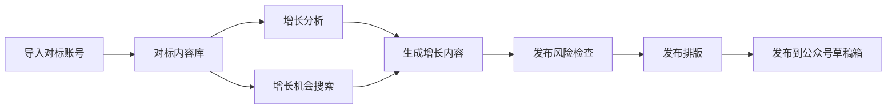
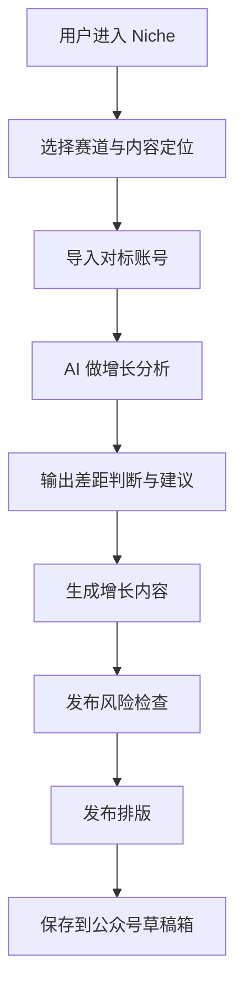

# Niche 最终版评审文稿

> 说明：本稿严格按照比赛模板结构压缩整理，适合直接转为 PDF。  
> 其中“选手姓名”“Demo 链接”请在导出前替换为你的真实信息。

---

## 封面页

### 作品名称

Niche

### 参赛赛道

命题赛道：题目 5《用 AI + 社媒流量密码，帮助普通 KOC 轻松涨粉》

### 选手姓名

黄文轩

### Demo 链接

https://niche-mlo7-theta.vercel.app/

---

## 模块一：用户洞察与问题定义

### 1. 目标用户

Niche 面向的是 **0-100 粉丝阶段的普通 KOC 和冷启动内容创作者**。这类用户通常具备持续表达意愿，也愿意投入时间做内容，但普遍缺少系统性的增长方法论，不知道自己该做什么方向、该对标谁、差距在哪里，也无法把零散的增长想法快速变成真正能发的内容。

从平台视角看，这类用户广泛存在于公众号、小红书、视频号等社媒平台。当前版本以公众号先落地，但方法论具备跨平台通用性。

### 2. 用户痛点

#### 痛点一：不知道该做什么方向

很多普通 KOC 最大的问题不是“不努力”，而是“不知道该发什么更有机会涨粉”。他们通常只有一个模糊方向，例如“AI设计”“职场成长”，却不知道哪个具体切口更适合自己，也不知道应该从评测、教程、观点还是记录切入。

#### 痛点二：看了很多对标账号，却看不清真正差距

用户能够感知到“别人做得更好”，但很难具体判断自己到底差在选题、标题、表达、结构还是节奏，因此经常陷入低效模仿。

#### 痛点三：分析和执行断裂

即使用户知道某个账号值得学，也很难继续把分析结果转化成自己的内容策略。分析归分析，执行归执行，真正落到“下一篇写什么、怎么写、什么时候发”时仍然无从下手。

#### 痛点四：发布前准备成本高

内容生成之后，用户仍然要面对平台风险检查、排版整理、发布操作等步骤。很多普通 KOC 在这里被进一步卡住，最终影响输出频率和增长节奏。

### 3. 使用场景

#### 场景一：冷启动用户寻找方向

用户刚开始做内容，已经有大致方向，也能说出几个想对标的账号，但完全不知道自己该从哪种内容切口进入。此时他需要：

- 看清对标账号为什么能火
- 判断什么方向更适合自己当前阶段
- 找到下一篇值得做的内容机会

#### 场景二：已有方向但增长缓慢

用户已经在持续发内容，但增长缓慢，怀疑自己与优秀账号之间存在选题、标题、结构或表达差距。此时他需要：

- 分析自己与对标账号的差距
- 找出当前最值得优先优化的部分
- 基于这些差距快速生成下一篇更有机会增长的内容

### 4. 产品概述

Niche 是一个面向冷启动 KOC 的 **AI 内容增长教练**。它不是单纯的写稿工具，而是围绕“找方向、拆对标、补差距、生成内容、完成发布准备”这一整条增长执行链路设计的 AI 产品。

一句话概括：

**Niche 用 AI 帮冷启动 KOC 找方向、拆对标、补差距，并直接产出可发布内容。**

---

## 模块二：产品方案设计

### 5. 核心功能

#### 5.1 导入对标账号

用户输入公众号名称、文章链接等信息，即可导入同赛道对标账号。系统会抓取文章内容和相关数据，为后续分析建立增长样本。

#### 5.2 对标内容库

系统将已导入账号和文章沉淀为结构化内容库，为后续分析、案例检索和内容生成提供依据。

#### 5.3 增长分析

系统基于对标内容库，回答“这个账号为什么能火”“它的标题和选题有什么规律”“我和它差在哪里”等问题，帮助用户看清增长短板。

#### 5.4 增长机会搜索

系统结合赛道理解、内容定位和热点搜索，帮助用户找到更适合当前阶段的内容机会，而不是简单给出泛热点。

#### 5.5 生成增长内容

系统不只给提纲，而是会直接生成完整可发布内容，包括标题、摘要和正文，把增长策略直接转成执行结果。

#### 5.6 发布风险检查

系统在内容生成后自动检查平台风险、限流风险和高风险表达，并给出替代表达建议。

#### 5.7 发布排版

系统使用稳定默认排版策略，把内容整理成更适合公众号阅读与发布的版式。

#### 5.8 发布到公众号

系统已支持通过官方 API + 固定 IP 网关，将内容保存到公众号草稿箱，打通发布前最后一步。

### 6. 产品架构 / 功能图

这套架构的核心在于：Niche 不是单点工具，而是一条从分析到执行的完整增长链路。

### 7. 交互流程

从用户体验上看，Niche 的关键价值不是“多一个功能”，而是把原本碎片化的增长动作串成一条顺滑的执行路径。

### 8. 创新与差异化

Niche 的创新点不在“会不会生成文案”，而在于它先帮助用户做 **增长判断**，再把这些判断变成内容执行。

与传统写作工具相比，Niche 更关注：

- 什么方向值得做
- 哪个对标账号值得学
- 用户和对标账号差距在哪里
- 怎样把增长策略变成内容

因此，Niche 更像一个真正参与内容增长决策和执行过程的 AI 教练，而不是一个只会吐文案的写作工具。

---

## 模块三：AI 原生能力说明

### 9. AI 核心能力

Niche 当前的 AI 核心能力包括：

- 对标内容检索与分析
- 热点与增长机会搜索
- 多步骤 Agent 执行
- 完整稿生成
- 平台风险检查
- 默认排版策略
- 发布链路串联

从能力类型来看，产品已经具备：

- 大模型理解与生成
- 检索增强
- 多工具协同
- 工作流级自动执行

### 10. AI 如何解决痛点

Niche 的 AI 不是在最后帮用户“润色一下”，而是从头到尾参与了最核心的增长工作：

- 判断哪些对标内容值得学
- 识别哪些方向更适合冷启动 KOC
- 生成贴合增长策略的完整内容
- 自动完成风险检查与发布前准备

如果去掉 AI：

- 对标分析会退化为静态数据罗列
- 热点搜索会退化为普通关键词检索
- 内容生成无法成立
- 风险检查与发布前准备将重新回到高人工成本状态

因此，AI 在 Niche 中不是附加功能，而是产品成立的前提。

### 11. AI 技术方案

当前技术方案采用 **大模型 + 工具链** 的组合方式：

- 大模型负责理解用户问题、分析对标内容、生成内容和总结建议
- Tavily 负责外部热点搜索
- 对标内容库负责内部案例检索
- 风险检查与默认排版策略负责发布前处理
- 微信官方 API + 固定 IP 网关负责发布链路

在执行层面，Niche 已经实现：

- 问题理解
- 工具路由
- 检索与分析
- 内容生成
- 发布前处理
- 发布动作落地

这说明 Niche 的 AI 不只是做单轮问答，而是在承担一整套内容增长工作流中的判断与执行职责。

---

## 模块四：加分项（可选）

### 12. 落地可行性

Niche 当前不是一个停留在概念层的产品，而是一条已经打通的真实工作流。当前已具备：

- 可运行的 Web Demo
- 对标账号导入
- 对标内容库沉淀
- 增长分析
- 增长机会搜索
- 完整内容生成
- 风险检查
- 排版预览
- 微信公众号草稿保存

说明其技术路线与业务链路都是清晰且可落地的。

### 13. 商业化思考

Niche 的商业化方向较明确：

- 面向普通 KOC 的订阅服务
- 面向小团队的内容增长工作台
- 面向品牌和机构的多账号内容策略辅助系统

同时，它具备较强的延展性：

- 当前以公众号先落地
- 后续可扩展到更多社媒平台
- 可进一步加入发布后复盘与增长反馈闭环

---

## 评分细则对照说明

### 1. 赛道适配性

Niche 与“帮助普通 KOC 轻松涨粉”的命题方向高度契合：

- 用户对象就是普通 KOC 与冷启动创作者
- 核心问题就是内容定位、对标分析、选题效率与发布执行
- 产品能力围绕内容增长链路构建，而不是泛用型写作工具

### 2. 作品完整性

Niche 已形成完整 Demo 闭环：

导入对标账号 -> 对标内容库 -> 增长分析 -> 增长机会搜索 -> 生成增长内容 -> 发布风险检查 -> 发布排版 -> 保存到公众号草稿箱

具备清晰逻辑、可运行 Demo 与可说明文档。

### 3. 创新性

创新点主要体现在：

- 把“增长判断”作为产品核心，而不是只做文案生成
- 用对标内容库帮助用户理解差距
- 将分析、生成、发布前准备和发布链路打通，形成 AI 执行闭环

### 4. 用户洞察深度与准确性

项目不是从“写作提效”出发，而是从冷启动 KOC 最真实的困难出发：

- 找不到方向
- 看不清差距
- 不知道该学什么
- 分析和执行断裂

这使得产品对用户场景的贴合度较高。

### 5. 方案 AI 原生性

AI 在 Niche 中承担了：

- 对标分析
- 热点与增长机会筛选
- 完整稿生成
- 风险检查
- 发布前准备

去掉 AI，方案的核心价值会显著削弱，因此具备较强 AI 原生性。

### 6. 落地可行性

当前版本已具备：

- Web Demo
- 数据沉淀
- Agent 工作流
- 排版与发布链路
- 微信公众号草稿保存

说明项目并不是概念展示，而具有明确技术路径和现实落地可能性。

### 7. 商业化能力

Niche 后续具备服务：

- 普通 KOC
- 小型内容团队
- 品牌与机构内容运营场景

的潜力，并可逐步扩展为更完整的多平台内容增长工作台。

---

## 总结

Niche 想解决的，不是“帮用户多写一篇文章”，而是帮助普通 KOC 看清方向、拆解对标、补齐差距，并把增长策略快速变成可发布内容。

对于 0-100 粉丝阶段的普通创作者来说，最缺的不是努力，而是一个真正懂增长的内容教练。Niche 希望用 AI 来承担这个角色。
